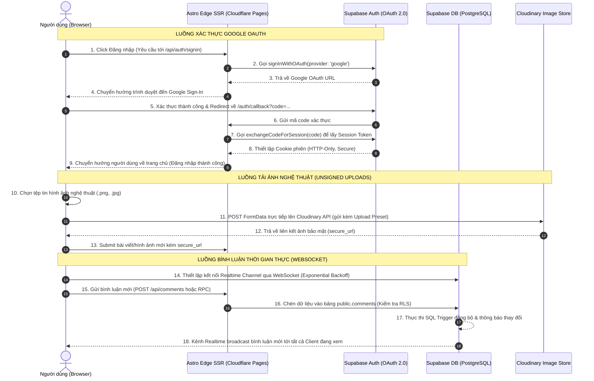

# **KẾ HOẠCH CHI TIẾT XÂY DỰNG WEBSITE TẠP CHÍ NGHỆ THUẬT VAPORWAVE**

Tài liệu này là bản kế hoạch triển khai chi tiết (Master Execution Plan) được xây dựng dựa trên tài liệu gốc **"Xây dựng website tạp chí nghệ thuật Vaporwave.md"**. Tài liệu cung cấp lộ trình từng bước, các tác vụ cụ thể, cấu trúc dữ liệu, các cấu hình hệ thống và kịch bản kiểm thử nhằm xây dựng hoàn chỉnh website tạp chí nghệ thuật phong cách Vaporwave cổ điển. 

Hệ thống được phát triển trên mô hình Jamstack hiện đại kết hợp hạ tầng biên (Edge Computing), tích hợp các thành phần cốt lõi: **Astro SSR, React, Tailwind CSS v4, Supabase (Database & Realtime Auth), Cloudinary và Cloudflare Pages**, đảm bảo hiệu năng tối ưu và chi phí vận hành ở mức 0 đồng.

---

## **MỤC TIÊU DỰ ÁN & CHỈ SỐ ĐÁNH GIÁ (KPIs/SLAs)**

*   **Hiệu năng (Performance):** Điểm Lighthouse tối thiểu đạt **95/100** trên môi trường máy tính và **90/100** trên thiết bị di động.
*   **Trải nghiệm người dùng:** Chỉ số **TTI (Time to Interactive) < 1.5 giây** thông qua cơ chế Astro Islands (chỉ hydrate các component React khi thực sự cần thiết).
*   **Thẩm mỹ trực quan (Aesthetic):** Tái hiện 100% không gian hoài cổ Vaporwave với giao diện giả lập Windows 95, hiệu ứng quét dòng CRT, nhiễu sóng kỹ thuật số (glitch) và bảng màu neon đặc trưng.
*   **Bảo mật:** Xác thực an toàn qua Google OAuth 2.0 lưu trữ session bằng Cookie phía máy chủ (HTTP-only, Secure, SameSite=Lax). Bảo mật dữ liệu ở cấp dòng (Row Level Security - RLS) trên Supabase Database.
*   **Chi phí:** Đạt ngưỡng **0 USD** chi phí duy trì trọn đời bằng cách kiểm soát chặt chẽ dung lượng sử dụng và lượt yêu cầu trong hạn mức miễn phí (Free Tiers) của Cloudflare, Supabase và Cloudinary.

---

## **SƠ ĐỒ LUỒNG DỮ LIỆU HỆ THỐNG (SYSTEM DATAFLOW DIAGRAM)**

Dưới đây là sơ đồ chi tiết biểu diễn luồng tương tác giữa Client, Server biên (Cloudflare Workers), Supabase Auth, Supabase Database và Cloudinary Store:



---

## **PHÂN RÃ CẤU TRÚC THƯ MỤC & MÔ TẢ CHỨC NĂNG TỪNG TỆP**

Hệ thống mã nguồn của dự án được phân chia theo cấu trúc mô-đun rõ ràng dưới đây:

```
├── .github/
│   └── workflows/
│       └── deploy.yml          # Tự động hóa CI/CD Cloudflare Pages khi push lên GitHub
├── src/
│   ├── components/             # Các khối React UI Components tương tác động
│   │   ├── CloudinaryUpload.tsx # Component chọn và tải ảnh lên Cloudinary (Win95 Style)
│   │   ├── RealtimeComments.tsx # Phân hệ bình luận thời gian thực qua WebSockets
│   │   └── Win95Window.tsx     # Khung cửa sổ Windows 95 tái sử dụng (Draggable/Resizable)
│   ├── layouts/                # Khung sườn bố cục trang của Astro
│   │   └── BaseLayout.astro    # Layout tổng thể tích hợp CRT Overlay và Scanlines
│   ├── lib/                    # Các tệp cấu hình và kết nối thư viện bổ trợ
│   │   └── supabase.ts         # Khởi tạo Supabase Server Client quản lý Cookie SSR
│   ├── pages/                  # Hệ thống điều hướng trang tự động (Astro File-based Routing)
│   │   ├── api/
│   │   │   └── auth/
│   │   │       ├── signin.ts   # Route API xử lý chuyển hướng đăng nhập Google OAuth
│   │   │       └── signout.ts  # Route API xóa Cookie phiên khi người dùng đăng xuất
│   │   ├── auth/
│   │   │   └── callback.astro  # Điểm tiếp nhận mã code OAuth và thiết lập Session
│   │   ├── articles/
│   │   │   └── [slug].astro    # Trang chi tiết bài viết nghệ thuật (SSR / Static Hybrid)
│   │   └── index.astro         # Trang chủ danh sách bài báo & phòng triển lãm Vaporwave
│   ├── styles/                 # Thư mục chứa cấu hình phong cách giao diện
│   │   └── global.css          # Tích hợp cấu hình Tailwind v4, biến theme và các lớp CRT
│   └── env.d.ts                # Định nghĩa kiểu dữ liệu TypeScript cho biến môi trường
├── astro.config.mjs            # Cấu hình hạt nhân của Astro tích hợp Cloudflare & React
├── package.json                # Khai báo các thư viện phụ thuộc và scripts vận hành
├── tsconfig.json               # Cấu hình trình biên dịch TypeScript
└── wrangler.jsonc              # Cấu hình môi trường thực thi Cloudflare Pages
```

---

## **KẾ HOẠCH TRIỂN KHAI CHI TIẾT THEO TỪNG GIAI ĐOẠN**

### **Giai đoạn 1: Khởi tạo Dự án & Cấu hình Hạ tầng**

*   **Mục tiêu:** Thiết lập môi trường phát triển cục bộ, cài đặt thư viện phụ thuộc và cấu hình các tệp tin hệ thống tương thích với Cloudflare Pages.
*   **Các bước thực hiện:**
    1.  Khởi tạo dự án Astro trống bằng lệnh:
        ```bash
        npx -y create-astro@latest ./ --template minimal --typescript strict --install --no-git
        ```
    2.  Cài đặt các gói phụ thuộc cần thiết cho dự án:
        ```bash
        npm install @astrojs/cloudflare @astrojs/react @astrojs/tailwind tailwindcss @supabase/supabase-js @supabase/ssr
        ```
    3.  Tạo tệp `wrangler.jsonc` tại thư mục gốc để cấu hình triển khai trên Cloudflare Pages:
        ```json
        {
          "name": "vaporwave-art-magazine",
          "compatibility_date": "2026-05-20",
          "compatibility_flags": [
            "nodejs_compat"
          ],
          "pages_build_output_dir": "dist"
        }
        ```
    4.  Cấu hình tệp `astro.config.mjs` chuyển đổi cơ chế kết xuất sang **Server-Side Rendering (SSR)** và tối ưu hóa xử lý ảnh:
        ```javascript
        import { defineConfig } from "astro/config";
        import cloudflare from "@astrojs/cloudflare";
        import react from "@astrojs/react";
        import tailwind from "@astrojs/tailwind";

        export default defineConfig({
          output: "server",
          adapter: cloudflare({
            imageService: {
              build: "compile",
              runtime: "cloudflare-binding"
            },
            sessionKVBindingName: undefined
          }),
          integrations: [react(), tailwind()],
          devToolbar: {
            enabled: false
          }
        });
        ```
    5.  Thiết lập tệp chứa biến môi trường mẫu `.env`:
        ```env
        PUBLIC_SUPABASE_URL=https://your-project-id.supabase.co
        PUBLIC_SUPABASE_ANON_KEY=your-supabase-anon-key
        PUBLIC_CLOUDINARY_CLOUD_NAME=your-cloudinary-cloud-name
        PUBLIC_CLOUDINARY_UPLOAD_PRESET=your-unsigned-upload-preset
        ```

---

### **Giai đoạn 2: Cài đặt Cơ sở dữ liệu Supabase & Bảo mật cấp dòng (RLS)**

*   **Mục tiêu:** Tạo cấu trúc bảng cơ sở dữ liệu lưu trữ hồ sơ người dùng, các bài viết và bình luận trên Supabase. Thiết lập các chính sách bảo mật cấp dòng (RLS) để ngăn chặn truy cập trái phép.
*   **Các bước thực hiện:**
    1.  Đăng nhập vào Supabase Dashboard, tạo một Project mới.
    2.  Truy cập **SQL Editor** trên Supabase, thực thi đoạn mã khởi tạo bảng hồ sơ người dùng (`public.profiles`) và cơ chế trigger tự động từ tài khoản Google OAuth:
        ```sql
        -- Tạo bảng lưu trữ thông tin hồ sơ người dùng trong schema public
        create table public.profiles (
          id uuid not null references auth.users on delete cascade,
          email text not null,
          full_name text,
          avatar_url text,
          created_at timestamp with time zone default timezone('utc'::text, now()) not null,
          primary key (id)
        );

        -- Kích hoạt chính sách bảo mật cấp dòng (Row Level Security - RLS)
        alter table public.profiles enable row level security;

        -- Cho phép tất cả mọi người được quyền xem hồ sơ công khai của người dùng khác
        create policy "Cho phép tất cả mọi người đọc hồ sơ" on public.profiles
          for select using (true);

        -- Cho phép chính chủ sửa đổi hồ sơ cá nhân của mình
        create policy "Cho phép người dùng tự chỉnh sửa hồ sơ bản thân" on public.profiles
          for update to authenticated using (auth.uid() = id);

        -- Định nghĩa hàm trigger để sao chép thông tin tài khoản tự động từ auth.users sang public.profiles
        create or replace function public.handle_new_google_user()
        returns trigger
        language plpgsql
        security definer set search_path = ''
        as $$
        begin
          insert into public.profiles (id, email, full_name, avatar_url)
          values (
            new.id,
            new.email,
            coalesce(new.raw_user_meta_data ->> 'full_name', new.raw_user_meta_data ->> 'name'),
            new.raw_user_meta_data ->> 'avatar_url'
          );
          return new;
        end;
        $$;

        -- Tạo trigger chạy tự động sau khi bản ghi mới được thêm thành công vào bảng auth.users
        create or replace trigger on_auth_user_created_google
          after insert on auth.users
          for each row execute procedure public.handle_new_google_user();
        ```
    3.  Khởi tạo bảng bình luận (`public.comments`) hỗ trợ tương tác thời gian thực:
        ```sql
        -- Tạo bảng lưu trữ bình luận bài viết
        create table public.comments (
          id uuid default gen_random_uuid() primary key,
          article_id text not null,
          profile_id uuid references public.profiles(id) on delete cascade not null,
          content text not null,
          created_at timestamp with time zone default timezone('utc'::text, now()) not null
        );

        -- Kích hoạt tính năng bảo mật dòng (RLS)
        alter table public.comments enable row level security;

        -- Cho phép tất cả mọi người được quyền đọc bình luận
        create policy "Cho phép tất cả mọi người đọc bình luận" on public.comments
          for select using (true);

        -- Chỉ cho phép người dùng đã đăng nhập thành công được viết bình luận dưới danh nghĩa chính mình
        create policy "Cho phép người dùng xác thực ghi nhận bình luận" on public.comments
          for insert to authenticated with check (auth.uid() = profile_id);
        ```
    4.  Kích hoạt tính năng **Realtime** cho bảng `public.comments` trong Supabase Console (*Database -> Replication -> Source -> Bật table comments*).

---

### **Giai đoạn 3: Tích hợp Xác thực Google OAuth SSR**

*   **Mục tiêu:** Xây dựng hệ thống đăng nhập, đăng xuất và đồng bộ thông tin tài khoản Google của người dùng thông qua Cookie an toàn phía máy chủ Astro SSR.
*   **Các bước thực hiện:**
    1.  Đăng ký thông tin **OAuth Client ID** trên Google Cloud Console, thiết lập **Authorized redirect URIs** là `https://<supabase-project-ref>.supabase.co/auth/v1/callback`. Tích hợp Client ID và Client Secret vào phần cấu hình Google Auth trên Supabase Dashboard.
    2.  Xây dựng tệp cấu hình kết nối Supabase Server Client `src/lib/supabase.ts`:
        ```typescript
        import { createServerClient, parseCookieHeader, type CookieOptionsWithName } from "@supabase/ssr";
        import type { AstroCookies } from "astro";

        export const cookieOptions: CookieOptionsWithName = {
          path: "/",
          secure: true,
          httpOnly: true,
          sameSite: "lax",
        };

        export function createSupabaseServerClient(context: { request: Request; cookies: AstroCookies }) {
          const supabaseUrl = import.meta.env.PUBLIC_SUPABASE_URL;
          const supabaseAnonKey = import.meta.env.PUBLIC_SUPABASE_ANON_KEY;

          if (!supabaseUrl || !supabaseAnonKey) {
            throw new Error("Biến môi trường của Supabase chưa được thiết lập đầy đủ.");
          }

          return createServerClient(
            supabaseUrl,
            supabaseAnonKey,
            {
              cookieOptions,
              cookies: {
                getAll() {
                  return parseCookieHeader(context.request.headers.get("Cookie") ?? "");
                },
                setAll(cookiesToSet) {
                  cookiesToSet.forEach(({ name, value, options }) => {
                    context.cookies.set(name, value, { ...cookieOptions, ...options });
                  });
                },
              },
            }
          );
        }
        ```
    3.  Viết API Route xử lý đăng nhập tại `src/pages/api/auth/signin.ts`:
        ```typescript
        import type { APIRoute } from "astro";
        import { createSupabaseServerClient } from "../../../lib/supabase";

        export const GET: APIRoute = async ({ request, cookies, url }) => {
          const supabase = createSupabaseServerClient({ request, cookies });
          const redirectUrl = `${url.origin}/auth/callback`;

          const { data, error } = await supabase.auth.signInWithOAuth({
            provider: "google",
            options: {
              redirectTo: redirectUrl,
            },
          });

          if (error) {
            return new Response(JSON.stringify({ error: error.message }), { status: 500 });
          }

          return Response.redirect(data.url, 307);
        };
        ```
    4.  Viết API Route xử lý đăng xuất tại `src/pages/api/auth/signout.ts`:
        ```typescript
        import type { APIRoute } from "astro";
        import { createSupabaseServerClient } from "../../../lib/supabase";

        export const POST: APIRoute = async ({ request, cookies }) => {
          const supabase = createSupabaseServerClient({ request, cookies });
          const { error } = await supabase.auth.signOut();

          if (error) {
            return new Response(JSON.stringify({ error: error.message }), { status: 500 });
          }

          return Response.redirect(new URL(request.url).origin, 303);
        };
        ```
    5.  Thiết lập trang xử lý phản hồi mã code xác thực tại `src/pages/auth/callback.astro`:
        ```astro
        ---
        import { createSupabaseServerClient } from "../../lib/supabase";

        const requestUrl = new URL(Astro.request.url);
        const code = requestUrl.searchParams.get("code");
        const next = requestUrl.searchParams.get("next") || "/";

        if (code) {
          const supabase = createSupabaseServerClient({
            request: Astro.request,
            cookies: Astro.cookies,
          });

          const { error } = await supabase.auth.exchangeCodeForSession(code);
          
          if (!error) {
            return Astro.redirect(next);
          }
          
          console.error("Lỗi trao đổi mã code xác thực:", error.message);
        }

        return Astro.redirect("/?error=auth-failed");
        ---
        ```

---

### **Giai đoạn 4: Thiết lập Thẩm mỹ Vaporwave & Giao diện Windows 95**

*   **Mục tiêu:** Cấu hình Tailwind CSS v4 và phát triển bộ khung CSS phụ trợ để kiến tạo giao diện tạp chí hoài cổ mang phong cách màn hình lồi CRT và các khung cửa sổ hệ điều hành Windows 95.
*   **Các bước thực hiện:**
    1.  Tạo tệp cấu hình phong cách `src/styles/global.css`, khai báo `@theme` động mới của Tailwind v4 và tích hợp hiệu ứng dòng quét (CRT scanline), nhiễu sóng (glitch) cùng với hoạt ảnh nhấp nháy CRT:
        ```css
        @import "tailwindcss";

        @theme {
          /* Hệ màu Vaporwave đặc trưng */
          --color-vapor-pink: #ff71ce;
          --color-vapor-blue: #01cdfe;
          --color-vapor-green: #05ffa1;
          --color-vapor-yellow: #fffb96;
          --color-vapor-purple: #b967ff;
          --color-win-gray: #c0c0c0;
          --color-win-dark: #808080;
          --color-cosmic-black: #0b001a;

          /* Font chữ hoài cổ */
          --font-retro: "MS Sans Serif", "Courier New", monospace;
          --font-cyber: "Satoshi", "Orbitron", sans-serif;

          /* Hoạt ảnh chuyển động Vaporwave */
          --animate-scanline: scanline 8s linear infinite;
          --animate-text-glitch: text-glitch 1.5s ease-in-out infinite alternate;
          --animate-crt-flicker: crt-flicker 0.15s infinite;

          @keyframes scanline {
            0% {
              transform: translateY(-100%);
            }
            100% {
              transform: translateY(100%);
            }
          }

          @keyframes text-glitch {
            0% {
              text-shadow: 1px 0 0 var(--color-vapor-pink), -1px 0 0 var(--color-vapor-blue);
            }
            50% {
              text-shadow: -2px 0 0 var(--color-vapor-pink), 2px 0 0 var(--color-vapor-blue);
            }
            100% {
              text-shadow: 1px 1px 0 var(--color-vapor-pink), -1px -1px 0 var(--color-vapor-blue);
            }
          }

          @keyframes crt-flicker {
            0% { opacity: 0.985; }
            50% { opacity: 0.995; }
            100% { opacity: 0.985; }
          }
        }

        /* Lớp CSS tạo hiệu ứng màn hình lồi CRT trên toàn website */
        .crt-overlay {
          position: relative;
          overflow: hidden;
          background-color: var(--color-cosmic-black);
        }

        .crt-overlay::before {
          content: " ";
          display: block;
          position: fixed;
          top: 0;
          left: 0;
          bottom: 0;
          right: 0;
          background: linear-gradient(
            rgba(18, 16, 16, 0) 50%, 
            rgba(0, 0, 0, 0.3) 50%
          ), linear-gradient(
            90deg, 
            rgba(255, 0, 0, 0.05), 
            rgba(0, 255, 0, 0.02), 
            rgba(0, 0, 255, 0.05)
          );
          background-size: 100% 4px, 3px 100%;
          z-index: 9999;
          pointer-events: none;
        }

        /* Dải neon CRT di chuyển từ trên xuống */
        .crt-scanline {
          position: fixed;
          top: 0;
          left: 0;
          width: 100%;
          height: 120px;
          background: linear-gradient(
            to bottom,
            rgba(255, 113, 206, 0),
            rgba(255, 113, 206, 0.06) 50%,
            rgba(255, 113, 206, 0)
          );
          z-index: 9998;
          pointer-events: none;
          animation: var(--animate-scanline);
        }

        /* Khung giao diện Windows 95 cổ điển */
        .win95-container {
          background-color: var(--color-win-gray);
          border-top: 2px solid #ffffff;
          border-left: 2px solid #ffffff;
          border-right: 2px solid var(--color-win-dark);
          border-bottom: 2px solid var(--color-win-dark);
          box-shadow: 1px 1px 0px 0px #000000;
          padding: 4px;
        }

        .win95-header {
          background: linear-gradient(90deg, #000080, #1084d0);
          color: #ffffff;
          font-family: var(--font-retro);
          font-weight: bold;
          font-size: 12px;
          padding: 4px 8px;
          display: flex;
          justify-content: space-between;
          align-items: center;
        }

        .win95-btn {
          background-color: var(--color-win-gray);
          border-top: 1.5px solid #ffffff;
          border-left: 1.5px solid #ffffff;
          border-right: 1.5px solid var(--color-win-dark);
          border-bottom: 1.5px solid var(--color-win-dark);
          padding: 2px 6px;
          font-size: 11px;
          font-family: var(--font-retro);
          color: #000000;
          cursor: pointer;
          box-shadow: inset 0.5px 0.5px 0px 0px #ffffff;
        }

        .win95-btn:active {
          border-top: 1.5px solid var(--color-win-dark);
          border-left: 1.5px solid var(--color-win-dark);
          border-right: 1.5px solid #ffffff;
          border-bottom: 1.5px solid #ffffff;
          padding: 3px 5px 1px 7px;
        }
        ```
    2.  Xây dựng layout nền tảng `src/layouts/BaseLayout.astro`:
        ```astro
        ---
        import "../styles/global.css";

        interface Props {
          title: string;
          description?: string;
        }

        const { title, description = "Tạp chí nghệ thuật số phong cách Vaporwave cổ điển" } = Astro.props;
        ---

        <html lang="vi">
          <head>
            <meta charset="utf-8" />
            <link rel="icon" type="image/svg+xml" href="/favicon.svg" />
            <meta name="viewport" content="width=device-width" />
            <meta name="generator" content={Astro.generator} />
            <title>{title}</title>
            <meta name="description" content={description} />
            <!-- Google Font: Orbitron & Outfit -->
            <link rel="preconnect" href="https://fonts.googleapis.com" />
            <link rel="preconnect" href="https://fonts.gstatic.com" crossorigin />
            <link href="https://fonts.googleapis.com/css2?family=Orbitron:wght@400;700;900&family=Outfit:wght@300;400;700&display=swap" rel="stylesheet" />
          </head>
          <body class="crt-overlay min-h-screen text-white font-sans selection:bg-vapor-pink selection:text-black">
            <!-- Lớp dòng quét CRT giả lập -->
            <div class="crt-scanline"></div>
            
            <!-- Bộ khung chứa trang web -->
            <div class="relative z-10 p-4 max-w-7xl mx-auto">
              <slot />
            </div>
          </body>
        </html>
        ```

---

### **Giai đoạn 5: Tải hình ảnh trực tiếp lên Cloudinary (Unsigned Uploads)**

*   **Mục tiêu:** Thiết lập Upload Preset không cần chữ ký trên Cloudinary và xây dựng React Component cho phép người dùng đăng tải các hình ảnh nghệ thuật trực tiếp từ giao diện giả lập Windows 95.
*   **Các bước thực hiện:**
    1.  Truy cập Cloudinary Console, tạo tài khoản miễn phí.
    2.  Vào phần **Settings -> Upload -> Upload presets -> Add upload preset**. Thiết lập chế độ là **Unsigned** và liên kết với một thư mục lưu trữ tùy ý. Lưu lại tên `Upload preset` này.
    3.  Tạo React Component `src/components/CloudinaryUpload.tsx` mô phỏng cửa sổ Windows 95 có thanh tiến trình upload hiệu ứng neon động:
        ```tsx
        import React, { useState, useRef } from "react";

        interface CloudinaryUploadProps {
          onUploadSuccess: (secureUrl: string) => void;
        }

        export const CloudinaryUpload: React.FC<CloudinaryUploadProps> = ({ onUploadSuccess }) => {
          const [isUploading, setIsUploading] = useState(false);
          const [imageUrl, setImageUrl] = useState<string | null>(null);
          const fileInputRef = useRef<HTMLInputElement>(null);

          const handleUpload = async (event: React.ChangeEvent<HTMLInputElement>) => {
            const file = event.target.files?.[0];
            if (!file) return;

            setIsUploading(true);
            setImageUrl(URL.createObjectURL(file));

            const cloudName = import.meta.env.PUBLIC_CLOUDINARY_CLOUD_NAME;
            const uploadPreset = import.meta.env.PUBLIC_CLOUDINARY_UPLOAD_PRESET;

            const formData = new FormData();
            formData.append("file", file);
            formData.append("upload_preset", uploadPreset);

            try {
              const response = await fetch(
                `https://api.cloudinary.com/v1_1/${cloudName}/image/upload`,
                {
                  method: "POST",
                  body: formData,
                }
              );

              if (!response.ok) {
                throw new Error("Tải lên hình ảnh thất bại.");
              }

              const responseData = await response.json();
              onUploadSuccess(responseData.secure_url);
            } catch (err) {
              console.error("Lỗi xảy ra trong quá trình upload ảnh:", err);
              alert("Đã xảy ra sự cố trong quá trình truyền tải tệp tin.");
            } finally {
              setIsUploading(false);
            }
          };

          return (
            <div className="win95-container max-w-sm w-full font-retro">
              <div className="win95-header">
                <span>ART_ARCHIVE.EXE</span>
                <button className="win95-btn py-0 px-1" onClick={() => setImageUrl(null)}>X</button>
              </div>
                
              <div className="p-4 bg-[#c0c0c0] flex flex-col items-center">
                <div className="w-full min-h-40 border-2 border-[#808080] bg-black mb-4 flex items-center justify-center relative overflow-hidden">
                  {imageUrl ? (
                    
                  ) : (
                    <div className="text-center text-vapor-pink p-2 animate-pulse">
                      <span className="block text-4xl mb-1">🖼️</span>
                      <p className="text-[10px] tracking-widest text-vapor-blue">WAITING FOR DATA...</p>
                    </div>
                  )}
                    
                  {isUploading && (
                    <div className="absolute inset-0 bg-black/75 flex flex-col items-center justify-center">
                      <div className="text-vapor-green text-xs mb-2 tracking-widest animate-pulse">UPLOADING...</div>
                      <div className="w-3/4 bg-[#808080] border border-white h-4 p-0.5">
                        <div className="bg-gradient-to-r from-vapor-pink via-vapor-purple to-vapor-blue h-full w-2/3 animate-[pulse_1s_infinite]"></div>
                      </div>
                    </div>
                  )}
                </div>

                <input 
                  type="file" 
                  ref={fileInputRef}
                  onChange={handleUpload}
                  accept="image/*"
                  className="hidden"
                  disabled={isUploading}
                />

                <button 
                  type="button"
                  onClick={() => fileInputRef.current?.click()}
                  disabled={isUploading}
                  className="win95-btn w-full text-xs py-2 tracking-wide font-bold"
                >
                  {isUploading ? "ĐANG XỬ LÝ..." : "CHỌN TỆP TIN ẢNH"}
                </button>
              </div>
            </div>
          );
        };
        ```

---

### **Giai đoạn 6: Hệ thống Bình luận động & Đồng bộ thời gian thực**

*   **Mục tiêu:** Xây dựng hệ thống bình luận WebSocket thời gian thực thông qua Supabase Realtime Client. Triển khai thuật toán **Exponential Backoff** tự động thử lại kết nối khi bị ngắt quãng hoặc mất mạng.
*   **Các bước thực hiện:**
    1.  Cài đặt kết nối WebSocket thời gian thực tích hợp công thức giãn cách Exponential Backoff:
        $$T_{retry} = \min(T_{max}, T_{base} \times M^n)$$
        Trong đó:
        *   $T_{base}$ (Thời gian trễ cơ sở): $1500$ mili-giây.
        *   $M$ (Hệ số nhân): $1.5$.
        *   $T_{max}$ (Mức trễ tối đa): $300000$ mili-giây (5 phút).
        *   $n$: Số lần kết nối thất bại liên tiếp trước đó.
    2.  Tạo React Component tương tác thời gian thực tại `src/components/RealtimeComments.tsx`:
        ```tsx
        import React, { useEffect, useState, useRef } from "react";
        import { createClient, type RealtimeChannel } from "@supabase/supabase-js";

        const supabaseUrl = import.meta.env.PUBLIC_SUPABASE_URL;
        const supabaseAnonKey = import.meta.env.PUBLIC_SUPABASE_ANON_KEY;
        const supabaseClient = createClient(supabaseUrl, supabaseAnonKey);

        interface Comment {
          id: string;
          article_id: string;
          content: string;
          created_at: string;
          profiles: {
            full_name: string;
            avatar_url: string;
          };
        }

        interface RealtimeCommentsProps {
          articleId: string;
          initialComments: Comment[];
          currentUser: {
            id: string;
            full_name: string;
            avatar_url: string;
          } | null;
        }

        export const RealtimeComments: React.FC<RealtimeCommentsProps> = ({
          articleId,
          initialComments,
          currentUser
        }) => {
          const [comments, setComments] = useState<Comment[]>(initialComments);
          const [inputText, setInputText] = useState("");
          const activeChannelRef = useRef<RealtimeChannel | null>(null);
            
          const retryCount = useRef(0);
          const maxRetries = 10;
          const baseDelay = 1500; 
          const maxDelay = 300000; 

          const establishRealtimeConnection = () => {
            if (activeChannelRef.current) {
              supabaseClient.removeChannel(activeChannelRef.current);
            }

            const channelName = `comments-realtime-${articleId}-${Date.now()}`;

            const channel = supabaseClient
              .channel(channelName)
              .on(
                "postgres_changes",
                {
                  event: "INSERT",
                  schema: "public",
                  table: "comments",
                  filter: `article_id=eq.${articleId}`
                },
                async (payload) => {
                  const { data: profile } = await supabaseClient
                    .from("profiles")
                    .select("full_name, avatar_url")
                    .eq("id", payload.new.profile_id)
                    .single();

                  const receivedComment: Comment = {
                    id: payload.new.id,
                    article_id: payload.new.article_id,
                    content: payload.new.content,
                    created_at: payload.new.created_at,
                    profiles: {
                      full_name: profile?.full_name || "Anonymous Developer",
                      avatar_url: profile?.avatar_url || "/images/default-avatar.png"
                    }
                  };

                  setComments((prevComments) => [...prevComments, receivedComment]);
                }
              )
              .subscribe((status) => {
                if (status === "SUBSCRIBED") {
                  console.log("Kênh kết nối bình luận thời gian thực đã hoạt động.");
                  retryCount.current = 0; 
                }

                if (status === "CHANNEL_ERROR" || status === "TIMED_OUT" || status === "CLOSED") {
                  console.warn(`Cảnh báo ngắt kết nối: ${status}. Đang kích hoạt tiến trình phục hồi...`);
                  handleReconnection();
                }
              });

            activeChannelRef.current = channel;
          };

          const handleReconnection = () => {
            if (retryCount.current >= maxRetries) {
              console.error("Hệ thống đã mất kết nối hoàn toàn với máy chủ thời gian thực.");
              return;
            }

            const nextDelay = Math.min(
              maxDelay,
              baseDelay * Math.pow(1.5, retryCount.current)
            );

            retryCount.current += 1;

            setTimeout(() => {
              establishRealtimeConnection();
            }, nextDelay);
          };

          useEffect(() => {
            establishRealtimeConnection();

            return () => {
              if (activeChannelRef.current) {
                supabaseClient.removeChannel(activeChannelRef.current);
              }
            };
          }, [articleId]);

          const postComment = async (event: React.FormEvent) => {
            event.preventDefault();
            if (!inputText.trim() || !currentUser) return;

            const { error } = await supabaseClient
              .from("comments")
              .insert({
                article_id: articleId,
                profile_id: currentUser.id,
                content: inputText.trim()
              });

            if (error) {
              console.error("Không thể hoàn tất gửi bình luận:", error.message);
            } else {
              setInputText("");
            }
          };

          return (
            <div className="win95-container w-full font-retro text-xs text-black">
              <div className="win95-header">
                <span>AESTHETIC_CHAT.EXE</span>
                <span className="text-[10px] tracking-widest text-vapor-green animate-pulse">● REALTIME</span>
              </div>
                
              <div className="p-3 bg-[#e6e6e6] space-y-3 h-72 overflow-y-auto border-b-2 border-[#808080] shadow-inner">
                {comments.length === 0 ? (
                  <div className="text-center text-[#808080] py-12">
                    <span className="text-2xl block mb-2">💾</span>
                    <p>CHƯA CÓ DỮ LIỆU BÌNH LUẬN.</p>
                  </div>
                ) : (
                  comments.map((comment) => (
                    <div key={comment.id} className="p-2 border border-[#808080] bg-white shadow-sm flex gap-3 items-start">
                      
                      <div className="flex-1">
                        <div className="flex justify-between items-center mb-1 text-vapor-purple font-bold">
                          <span>{comment.profiles.full_name}</span>
                          <span className="text-[9px] text-[#808080] font-normal">
                            {new Date(comment.created_at).toLocaleTimeString()}
                          </span>
                        </div>
                        <p className="text-black bg-[#f0f0f0] p-1.5 border border-dashed border-[#808080]/50">{comment.content}</p>
                      </div>
                    </div>
                  ))
                )}
              </div>

              {currentUser ? (
                <form onSubmit={postComment} className="p-3 bg-win-gray flex gap-2">
                  <input
                    type="text"
                    className="flex-1 p-2 border border-[#808080] bg-white outline-none font-retro text-xs text-black shadow-inner focus:border-vapor-pink"
                    placeholder="Gõ suy nghĩ nghệ thuật của bạn tại đây..."
                    value={inputText}
                    onChange={(e) => setInputText(e.target.value)}
                  />
                  <button type="submit" className="win95-btn font-bold px-6">
                    GỬI
                  </button>
                </form>
              ) : (
                <div className="p-3 bg-[#d4d4d4] text-center border-t border-white text-[#808080]">
                  VUI LÒNG ĐĂNG NHẬP QUA GOOGLE ĐỂ GỬI BÌNH LUẬN.
                </div>
              )}
            </div>
          );
        };
        ```

---

### **Giai đoạn 7: Xây dựng các Trang Giao diện Chính (Home & Article Detail)**

*   **Mục tiêu:** Tạo dựng trang chủ trưng bày các bài viết nghệ thuật và trang chi tiết bài viết tích hợp hiệu ứng thị giác giả lập Windows 95, kết hợp các Astro Islands để tải các component React động.
*   **Các bước thực hiện:**
    1.  Xây dựng trang chủ `src/pages/index.astro` để lấy thông tin phiên hoạt động người dùng và hiển thị danh sách bài báo hoài cổ:
        ```astro
        ---
        import BaseLayout from "../layouts/BaseLayout.astro";
        import { createSupabaseServerClient } from "../lib/supabase";

        const supabase = createSupabaseServerClient({
          request: Astro.request,
          cookies: Astro.cookies
        });

        // Lấy thông tin người dùng hiện tại
        const { data: { user } } = await supabase.auth.getUser();
        let userProfile = null;

        if (user) {
          const { data } = await supabase
            .from("profiles")
            .select("*")
            .eq("id", user.id)
            .single();
          userProfile = data;
        }

        // Danh sách bài viết nghệ thuật Vaporwave mẫu
        const articles = [
          {
            slug: "retro-computing-aesthetic",
            title: "Hoài Niệm Windows 95: Vẻ Đẹp Của Hệ Điều Hành Cổ Điển",
            description: "Khám phá phong cách thiết kế đồ họa máy tính thời kỳ đầu, cội nguồn của làn sóng nghệ thuật hoài cổ Vaporwave.",
            cover: "https://images.unsplash.com/photo-1550751827-4bd374c3f58b?w=600&auto=format&fit=crop",
            date: "2026-05-20"
          },
          {
            slug: "neon-dreamscape-art",
            title: "Neon Dreamscape: Sự Trỗi Dậy Của Không Gian Màu Neon 3D",
            description: "Tại sao những gam màu hồng rực rỡ và xanh điện tử tiếp tục thống trị nghệ thuật kỹ thuật số hiện đại.",
            cover: "https://images.unsplash.com/photo-1508739773434-c26b3d09e071?w=600&auto=format&fit=crop",
            date: "2026-05-18"
          }
        ];
        ---

        <BaseLayout title="VAPORWAVE ART JOURNAL // HOME">
          <!-- Thanh điều hướng Windows 95 Desktop Menu -->
          <div class="win95-container w-full mb-6 font-retro">
            <div class="flex justify-between items-center bg-[#c0c0c0] p-1">
              <div class="flex gap-2">
                <button class="win95-btn font-bold px-3 py-1 flex items-center gap-1">
                  💾 Start
                </button>
                <div class="border-l border-white h-6 my-auto mx-1"></div>
                <span class="text-xs text-black my-auto font-bold tracking-wider">AESTHETIC_JOURNAL_V1.EXE</span>
              </div>
              <div class="flex gap-3 items-center">
                {userProfile ? (
                  <div class="flex gap-2 items-center">
                    
                    <span class="text-xs text-black font-bold">{userProfile.full_name}</span>
                    <form action="/api/auth/signout" method="POST">
                      <button type="submit" class="win95-btn text-xs">Đăng xuất</button>
                    </form>
                  </div>
                ) : (
                  <a href="/api/auth/signin" class="win95-btn text-xs font-bold text-black no-underline">
                    🔑 Đăng Nhập Bằng Google
                  </a>
                )}
              </div>
            </div>
          </div>

          <!-- Tiêu đề lớn hiệu ứng Glitch -->
          <div class="text-center py-10">
            <h1 class="text-5xl md:text-7xl font-extrabold uppercase tracking-widest text-vapor-pink animate-text-glitch font-retro">
              Vapor Journal
            </h1>
            <p class="text-xs tracking-[0.3em] text-vapor-blue mt-4 font-retro uppercase">
              // A Cybernetic Oasis of Digital Nostalgia //
            </p>
          </div>

          <!-- Danh sách bài báo -->
          <div class="grid md:grid-cols-2 gap-8 mt-10">
            {articles.map(article => (
              <div class="win95-container font-retro flex flex-col justify-between">
                <div>
                  <div class="win95-header">
                    <span>ART_VIEWER.EXE</span>
                    <button class="win95-btn py-0 px-1">?</button>
                  </div>
                  <div class="p-3 bg-[#c0c0c0]">
                    
                    <h2 class="text-lg font-bold text-black mt-3 mb-2">{article.title}</h2>
                    <p class="text-xs text-black/85 leading-relaxed">{article.description}</p>
                  </div>
                </div>
                <div class="p-3 bg-[#c0c0c0] pt-0 flex justify-between items-center">
                  <span class="text-[10px] text-black/60">{article.date}</span>
                  <a href={`/articles/${article.slug}`} class="win95-btn no-underline inline-block px-4 py-1 text-black font-bold text-xs">
                    ĐỌC BÀI VIẾT >>
                  </a>
                </div>
              </div>
            ))}
          </div>
        </BaseLayout>
        ```
    2.  Xây dựng trang chi tiết bài viết `src/pages/articles/[slug].astro` tích hợp phân hệ bình luận thời gian thực (được nạp dạng React Island):
        ```astro
        ---
        import BaseLayout from "../../layouts/BaseLayout.astro";
        import { createSupabaseServerClient } from "../../lib/supabase";
        import { RealtimeComments } from "../../components/RealtimeComments";

        const { slug } = Astro.params;

        const supabase = createSupabaseServerClient({
          request: Astro.request,
          cookies: Astro.cookies
        });

        // Lấy thông tin người dùng hiện tại
        const { data: { user } } = await supabase.auth.getUser();
        let currentUser = null;

        if (user) {
          const { data } = await supabase
            .from("profiles")
            .select("id, full_name, avatar_url")
            .eq("id", user.id)
            .single();
          currentUser = data;
        }

        // Tải danh sách bình luận ban đầu từ Supabase Server-side
        const { data: initialComments = [] } = await supabase
          .from("comments")
          .select("id, article_id, content, created_at, profiles(full_name, avatar_url)")
          .eq("article_id", slug)
          .order("created_at", { ascending: true });

        // Dữ liệu nội dung bài viết tĩnh giả định dựa trên Slug
        const articleData = {
          title: slug === "retro-computing-aesthetic" 
            ? "Hoài Niệm Windows 95: Vẻ Đẹp Của Hệ Điều Hành Cổ Điển"
            : "Neon Dreamscape: Sự Trỗi Dậy Của Không Gian Màu Neon 3D",
          content: "Không gian mạng (Cyberspace) và hoài cổ kỹ thuật số luôn là các chủ đề cốt lõi của nghệ thuật Vaporwave. Bằng cách sử dụng các hình ảnh kiến trúc cổ điển Hy Lạp kết hợp với giao diện desktop xám xi măng của Windows 95, các tác phẩm Vaporwave tạo ra cảm giác lơ lửng, hư vô của thời gian. Các đường kẻ CRT ngang màn hình cùng với hoạt ảnh lỗi kỹ thuật (glitch) không chỉ là công cụ trang trí, mà còn là bản tuyên ngôn phản kháng lại tính sắc sảo của thời kỳ đồ họa độ phân giải siêu cao ngày nay...",
          cover: slug === "retro-computing-aesthetic"
            ? "https://images.unsplash.com/photo-1550751827-4bd374c3f58b?w=1000&auto=format&fit=crop"
            : "https://images.unsplash.com/photo-1508739773434-c26b3d09e071?w=1000&auto=format&fit=crop",
          date: "2026-05-20"
        };
        ---

        <BaseLayout title={`${articleData.title} // VAPOR JOURNAL`}>
          <!-- Quay lại Trang chủ -->
          <div class="mb-6 font-retro">
            <a href="/" class="win95-btn no-underline inline-block text-black px-4 py-1.5 font-bold">
              << QUAY LẠI TRANG CHỦ
            </a>
          </div>

          <!-- Chi tiết Bài báo -->
          <div class="win95-container w-full font-retro mb-10 text-black">
            <div class="win95-header">
              <span>EXPLORER.EXE - {articleData.title}</span>
              <button class="win95-btn py-0 px-1">X</button>
            </div>
            <div class="p-6 bg-[#c0c0c0]">
              
              <div class="border-b border-[#808080] pb-4 mb-6">
                <h1 class="text-2xl md:text-4xl font-extrabold uppercase">{articleData.title}</h1>
                <p class="text-xs text-[#808080] mt-2">Xuất bản lúc: {articleData.date} // Tác giả: AESTHETIC WRITER</p>
              </div>
              <article class="text-sm leading-relaxed whitespace-pre-line text-justify text-black/90">
                {articleData.content}
              </article>
            </div>
          </div>

          <!-- Phân hệ bình luận thời gian thực (React Island tải trực tiếp trên client) -->
          <div class="max-w-3xl mx-auto">
            <h3 class="text-xl font-retro text-vapor-pink tracking-widest uppercase mb-4 text-center">
              // THẢO LUẬN NGHỆ THUẬT //
            </h3>
            <RealtimeComments 
              client:load 
              articleId={slug} 
              initialComments={initialComments} 
              currentUser={currentUser} 
            />
          </div>
        </BaseLayout>
        ```

---

### **Giai đoạn 8: Thiết lập Luồng CI/CD & Triển khai ứng dụng**

*   **Mục tiêu:** Cấu hình luồng tự động biên dịch và triển khai ứng dụng (CI/CD) lên Cloudflare Pages mỗi khi mã nguồn được đẩy lên nhánh chính của GitHub.
*   **Các bước thực hiện:**
    1.  Tạo tệp cấu hình quy trình GitHub Actions tại `.github/workflows/deploy.yml`:
        ```yaml
        name: Cloudflare Pages Auto Deploy

        on:
          push:
            branches:
              - main
          pull_request:
            branches:
              - main

        jobs:
          deploy:
            runs-on: ubuntu-latest
            permissions:
              contents: read
              deployments: write
            steps:
              - name: Checkout mã nguồn
                uses: actions/checkout@v4

              - name: Cài đặt Node.js
                uses: actions/setup-node@v4
                with:
                  node-version: 20
                  cache: 'npm'

              - name: Cài đặt gói phụ thuộc
                run: npm ci

              - name: Biên dịch mã nguồn ứng dụng (Astro Build)
                run: npm run build
                env:
                  PUBLIC_SUPABASE_URL: ${{ secrets.PUBLIC_SUPABASE_URL }}
                  PUBLIC_SUPABASE_ANON_KEY: ${{ secrets.PUBLIC_SUPABASE_ANON_KEY }}
                  PUBLIC_CLOUDINARY_CLOUD_NAME: ${{ secrets.PUBLIC_CLOUDINARY_CLOUD_NAME }}
                  PUBLIC_CLOUDINARY_UPLOAD_PRESET: ${{ secrets.PUBLIC_CLOUDINARY_UPLOAD_PRESET }}

              - name: Đăng tải trực tiếp lên Cloudflare Pages
                uses: cloudflare/wrangler-action@v3
                with:
                  apiToken: ${{ secrets.CLOUDFLARE_API_TOKEN }}
                  accountId: ${{ secrets.CLOUDFLARE_ACCOUNT_ID }}
                  command: pages deploy dist --project-name=vaporwave-art-magazine
        ```
    2.  Đăng ký tài khoản Cloudflare Pages, tạo Project mới loại **Pages** kết nối trực tiếp với Repo GitHub.
    3.  Tích hợp các biến môi trường cấu hình của Supabase và Cloudinary vào mục **Settings -> Environment Variables** trên Cloudflare Pages Console để đảm bảo ứng dụng biên dịch thành công.

---

## **KỊCH BẢN KIỂM THỬ & NGHIỆM THU (TESTING & QA SCRIPTS)**

Để đảm bảo các phân hệ hoạt động liền mạch và an toàn, đội ngũ phát triển cần thực thi nghiêm ngặt các quy trình kiểm thử sau:

### **1. Kiểm thử xác thực Google OAuth SSR**
*   **Các bước kiểm tra:**
    1.  Tại trang chủ, nhấn vào nút "Đăng Nhập Bằng Google".
    2.  Hệ thống phải chuyển hướng chính xác đến trang chọn tài khoản của Google.
    3.  Sau khi đăng nhập tài khoản Google thành công, trình duyệt phải chuyển hướng về `/auth/callback?code=...` rồi quay lại trang chủ.
    4.  Kiểm tra cookie: Nhấn F12 -> Application -> Cookies. Phải xuất hiện cookie phiên của Supabase với các thuộc tính bảo mật `HttpOnly`, `Secure` và `SameSite=Lax` được bật.
    5.  Kiểm tra cơ sở dữ liệu: Trên Supabase SQL Editor, thực thi lệnh `select * from public.profiles;`. Bản ghi thông tin tài khoản Google của bạn phải được đồng bộ chính xác tự động.

### **2. Kiểm thử tải ảnh trực tiếp lên Cloudinary**
*   **Các bước kiểm tra:**
    1.  Tại màn hình component `CloudinaryUpload`, click vào nút "CHỌN TỆP TIN ẢNH".
    2.  Chọn một ảnh bất kỳ. Trình duyệt phải hiển thị bản xem trước (Preview) ngay lập tức.
    3.  Thanh tiến trình neon dạng Windows 95 xuất hiện trạng thái "UPLOADING...".
    4.  Sau khi upload thành công, ảnh xem trước phải hiển thị rõ nét và hàm callback báo cáo liên kết secure_url về máy chủ.
    5.  Truy cập Cloudinary Library để xác nhận ảnh vừa chọn đã nằm gọn trong thư mục chỉ định.

### **3. Kiểm thử bình luận thời gian thực (Realtime comments)**
*   **Các bước kiểm tra:**
    1.  Mở song song **hai cửa sổ ẩn danh** cùng truy cập vào chi tiết bài báo `/articles/retro-computing-aesthetic`.
    2.  Đăng nhập tài khoản Google trên cả hai cửa sổ.
    3.  Tại cửa sổ A, gõ một bình luận bất kỳ và nhấn "GỬI".
    4.  Cửa sổ B phải ngay lập tức xuất hiện nội dung bình luận vừa gõ cùng tên và ảnh đại diện của tài khoản A thông qua kết nối WebSocket, **không được có độ trễ > 500ms** và **không cần tải lại trang**.

### **4. Kiểm thử khả năng chịu lỗi và tự hồi phục kết nối (Exponential Backoff Connection)**
*   **Các bước kiểm tra:**
    1.  Đang mở kênh chat bình luận, tiến hành **tắt kết nối Internet** (hoặc chuyển sang chế độ Offline trên DevTools).
    2.  Bảng điều khiển (Console) phải xuất hiện dòng cảnh báo: `Cảnh báo ngắt kết nối: CHANNEL_ERROR. Đang kích hoạt tiến trình phục hồi...`.
    3.  Kiểm tra tần suất kết nối lại: Lần thử 1 cách lần trước 1.5s, lần 2 cách lần trước 2.25s, lần 3 cách lần trước 3.37s... đúng theo cấp số nhân công thức giãn cách.
    4.  Bật lại mạng Internet. Hệ thống phải tự động kết nối lại thành công, Console ghi nhận `Kênh kết nối bình luận thời gian thực đã hoạt động` và bộ đếm thất bại `retryCount` tự động đặt về 0.

---

## **BẢNG PHÂN BỔ TÀI NGUYÊN & GIỚI HẠN VẬN HÀNH MIỄN PHÍ**

Dự án được tối ưu hóa tài nguyên cực kỳ khắt khe để đảm bảo luôn nằm trong hạn mức miễn phí trọn đời:

| Thành phần hạ tầng | Hạn mức Free Tier của nhà cung cấp | Mức tiêu thụ dự kiến của dự án | Phương án tối ưu hóa chi phí |
| :--- | :--- | :--- | :--- |
| **Cloudflare Pages** | - Băng thông: Không giới hạn.<br>- Yêu cầu động: 100,000 requests/ngày. | - Băng thông: ~5GB/tháng.<br>- Yêu cầu động: 15,000 requests/ngày. | Prerender (tiền biên dịch) toàn bộ các trang nội dung tĩnh để giảm tải yêu cầu xử lý động của Workers. |
| **Supabase Database**| - Dung lượng lưu trữ: 500 MB PostgreSQL.<br>- Kết nối đồng thời: 200 connections. | - Dung lượng lưu trữ: ~10 MB.<br>- Kết nối đồng thời: ~20 connections. | Tắt toàn bộ các truy vấn thừa, chỉ mở kết nối thời gian thực cho bảng bình luận. |
| **Cloudinary Store** | - Dung lượng & Băng thông: 25 Credits/tháng (~25 GB dung lượng). | - Dung lượng & Băng thông: ~1 GB/tháng. | Tự động nén chất lượng ảnh và chuyển đổi định dạng thông minh sang WebP/AVIF trên biên lý Cloudinary CDN. |

---

## **CHỈ DẪN NẠP DỮ LIỆU ĐỂ CODE NHANH DÀNH CHO CÔNG CỤ AI (VIBECODING)**

Khi lập trình viên đưa tài liệu kế hoạch này vào các công cụ lập trình tự động bằng ngôn ngữ tự nhiên (AI Agents / Vibecoding Tools), hãy sử dụng mẫu câu lệnh (Prompt Template) tối ưu hóa sau để đạt kết quả tốt nhất:

> [!TIP]
> **Mẫu lệnh nạp cho AI (System prompt / Context Feed):**
> 
> *"Bạn là một chuyên gia lập trình web cao cấp. Hãy đọc kỹ kế hoạch chi tiết xây dựng website tạp chí nghệ thuật Vaporwave trong tài liệu này. 
> 
> Hãy tiến hành xây dựng dự án theo đúng cấu trúc thư mục quy định. Tích hợp sâu cấu hình hệ màu sắc hoài cổ Vaporwave và các lớp phủ CRT đặc trưng vào tệp `src/styles/global.css`. Đảm bảo các phân hệ xác thực Cookie SSR qua Supabase an toàn và hệ thống bình luận WebSocket thời gian thực hoạt động bền bỉ, tích hợp đúng thuật toán tự phục hồi kết nối Exponential Backoff. Tuyệt đối tuân thủ chỉ dẫn tối ưu hiệu năng không vượt quá hạn mức tài nguyên miễn phí của hệ thống."*

---

### **TÀI LIỆU THAM KHẢO & NGUỒN DẪN CHỨNG**
1. *Tài liệu kỹ thuật Astro Cloudflare Adapter:* [https://docs.astro.build/en/guides/integrations-guide/cloudflare/](https://docs.astro.build/en/guides/integrations-guide/cloudflare/)
2. *Hướng dẫn xác thực Supabase SSR trên môi trường Astro:* [https://supabase.com/docs/guides/auth/quickstarts/astrojs](https://supabase.com/docs/guides/auth/quickstarts/astrojs)
3. *Trình quản lý tải ảnh Cloudinary Unsigned Uploads:* [https://github.com/Akkisdiary/cloudinary-image-upload](https://github.com/Akkisdiary/cloudinary-image-upload)
4. *Thuật toán Exponential Backoff và WebSocket tự phục hồi:* [https://medium.com/@dipiash/supabase-realtime-postgres-changes-in-node-js-2666009230b0](https://medium.com/@dipiash/supabase-realtime-postgres-changes-in-node-js-2666009230b0)
