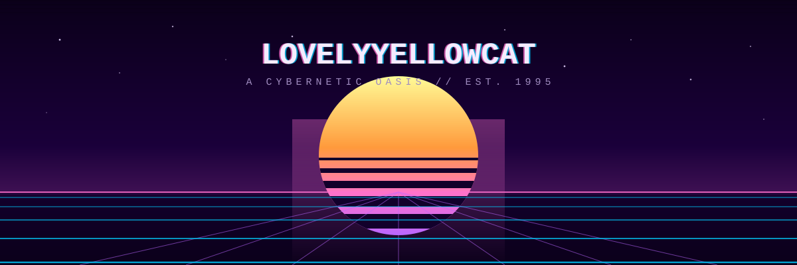
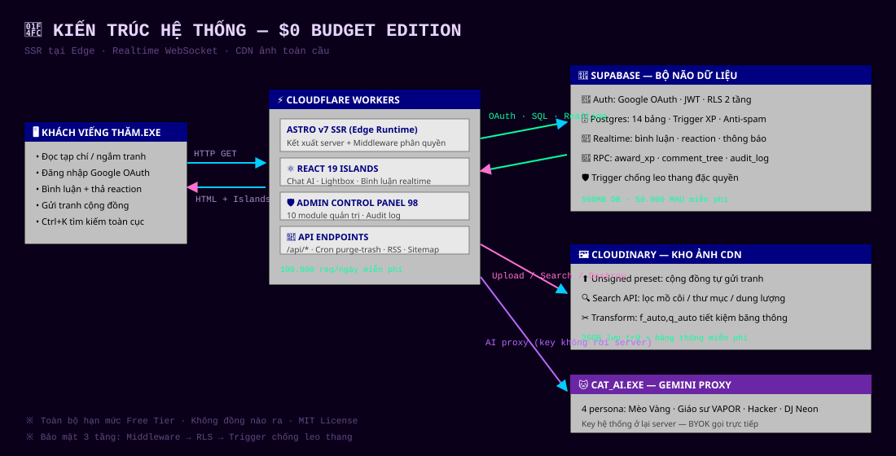
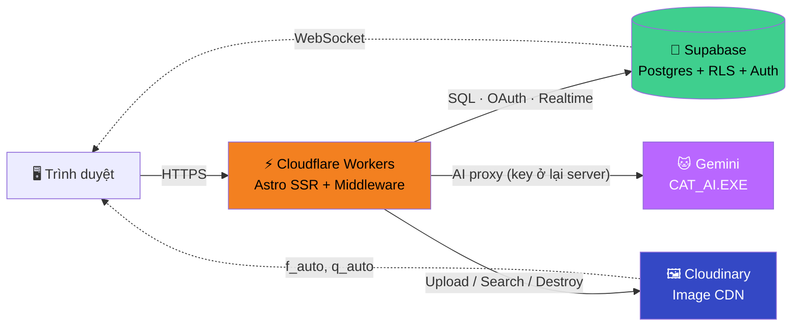
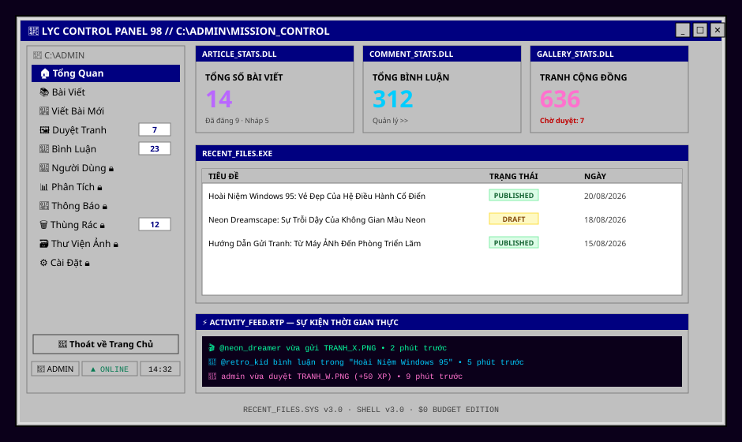
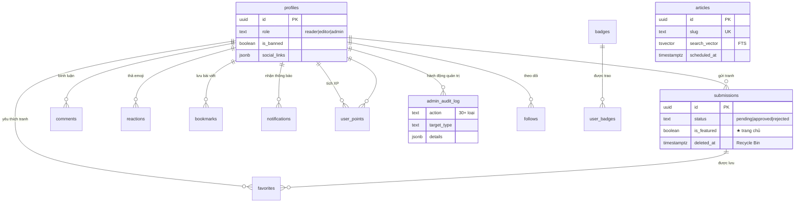

# 📼 LOVELYYELLOWCAT — VAPORWAVE ART MAGAZINE

<div align="center">

```
  ██╗      ██████╗ ██╗   ██╗███████╗████████╗██╗  ██╗   ██╗███████╗███████╗
  ██║     ██╔═══██╗╚██╗ ██╔╝██╔════╝╚══██╔══╝██║  ╚██╗ ██╔╝██╔════╝██╔════╝
  ██║     ██║   ██║ ╚████╔╝ █████╗     ██║   ██║   ╚████╔╝ █████╗  ███████╗
  ██║     ██║   ██║  ╚██╔╝  ██╔══╝     ██║   ██║    ╚██╔╝  ██╔══╝  ╚════██║
  ███████╗╚██████╔╝   ██║   ███████╗   ██║   ███████╗██║   ███████╗███████║
  ╚══════╝ ╚═════╝    ╚═╝   ╚══════╝   ╚═╝   ╚══════╝╚═╝   ╚══════╝╚══════╝
              ── A CYBERNETIC OASIS · EST. 1995 · BUDGET: $0 ──
```

**Tạp chí nghệ thuật Vaporwave & Phòng triển lãm cộng đồng**
*Kết xuất tại Edge · Thẩm mỹ Windows 95 × Catalog Dell 1996 · Realtime toàn phần*




</div>

> ```log
> [BOOT] LOVELYYELLOWCAT BIOS v3.0 ................. OK
> [BOOT] Nạp VAPORWAVE.SYS · CRT_SCANLINE.DRV ...... OK
> [BOOT] Kết nối SUPABASE (Postgres + Realtime) .... OK
> [BOOT] Gắn CLOUDINARY VAULT (25GB) ............... OK
> [BOOT] Khởi động MEOW_ENGINE.EXE 🐱 .............. OK
> [ OK ] Hệ thống sẵn sàng. Chào mừng đến Cybernetic Oasis.
> ```

---

## 🗺️ MỤC LỤC

| | Mục | | Mục |
|---|---|---|---|
| 1️⃣ | [Đây là cái gì?](#1️⃣-đây-là-cái-gì) | 6️⃣ | [Cơ sở dữ liệu](#6️⃣-cơ-sở-dữ-liệu) |
| 2️⃣ | [Kiến trúc Edge](#2️⃣-kiến-trúc-edge) | 7️⃣ | [Bảo mật 3 tầng](#7️⃣-bảo-mật-3-tầng) |
| 3️⃣ | [Bảng màu & Design System](#3️⃣-bảng-màu--design-system) | 8️⃣ | [Trải nghiệm tương tác](#8️⃣-trải-nghiệm-tương-tác) |
| 4️⃣ | [Khu công cộng](#4️⃣-khu-công-cộng) | 9️⃣ | [Cài đặt & Deploy](#9️⃣-cài-đặt--deploy) |
| 5️⃣ | [Control Panel 98 (Admin)](#5️⃣-control-panel-98-admin) | 🔟 | [Credits](#-credits) |

---

## 1️⃣ ĐÂY LÀ CÁI GÌ?

Hãy tưởng tượng bạn bước vào một **tiệm điện tử bỏ hoang năm 1995** — màn hình CRT còn sáng, băng VHS vẫn quay, và trên tường treo đầy tranh do cộng đồng mạng gửi về từ khắp nơi. Đó chính là LovelyYellowCat: một **tạp chí nghệ thuật số** nơi mọi người đăng tranh Vaporwave, đọc bài viết thẩm mỹ, trò chuyện realtime — và toàn bộ hạ tầng vận hành với **chi phí 0 đồng/tháng**.

| Trụ cột | Nội dung |
|---|---|
| 🎨 **Sân chơi nghệ thuật** | Triển lãm masonry vô tận · Lightbox 7 filter CRT/VHS/GameBoy · Gửi tranh qua wizard InstallShield |
| 📰 **Tạp chí có hồn** | Bài viết đọc trong khung WordPad · TOC scrollspy · Bookmark đọc sau · RSS đầy đủ |
| ⚡ **Realtime 100%** | Bình luận lồng nhau · Reaction nổ hạt neon · Thông báo 8-bit · Exponential backoff tự phục hồi |
| 🕹 **Admin = Hệ điều hành** | Control Panel 98 với 10 module · Duyệt tranh kiểu Outlook Express · Thùng rác thật · Audit log |

---

## 2️⃣ KIẾN TRÚC EDGE

Mọi request được phục vụ từ máy chủ biên **gần người đọc nhất** — Astro SSR chạy trực tiếp trên Cloudflare Workers, database và kho ảnh là các dịch vụ chuyên biệt:





**Vì sao kiến trúc này "free-tier maximalist"?** Mỗi dịch vụ đều nằm gọn hạn mức miễn phí (100k req/ngày · 500MB DB · 25GB ảnh) và không dịch vụ nào phụ thuộc dịch vụ nào — chết 1 nhánh, các nhánh còn lại vẫn thở.

---

## 3️⃣ BẢNG MÀU & DESIGN SYSTEM

Hệ màu được token hóa 100% trong `@theme` của Tailwind v4 — **cấm hex trực tiếp trong component**. Ba thế giới màu chung sống: neon Vaporwave, nền vũ trụ sâu, và xám Windows 95.

| Họ màu | Token | Màu | Dùng cho |
|---|---|---|---|
| 🌸 **Neon Signature** | `vapor-pink` |  | Màu chủ đạo, CTA, glow |
| 🌊 | `vapor-blue` |  | Link, focus ring, thông tin |
| 🔮 | `vapor-purple` |  | Accent, gradient header |
| 🌱 | `vapor-green` |  | Trạng thái thành công, XP |
| 🌅 | `vapor-orange` |  | Banner thông báo |
| 🌌 **Dark Space** | `cosmic-black` |  | Nền trang |
| 🪟 **Win95** | `win-gray` |  | Toàn bộ "vỏ sò" cửa sổ |
| 🔵 | `win-titlebar` |  | Thanh tiêu đề huyền thoại |
| 🎨 **Ribbon Tint** ×8 | `tint-*` | sage · salmon · peach · lime · sky · steel · periwinkle · olive | Thẻ catalog Dell-1996 |

**Bộ công cụ UI có sẵn**: shadow bevel 4 lớp chuẩn Win95 (`.win95-container`) · nút lõm khi nhấn (`.win95-btn`) · bảng `.win-table` · badge ngữ cảnh `.badge-*` · checkbox/select/progress/skeleton · scrollbar kẻ ô caro · con trỏ chuột SVG tùy biến · tier animation tôn trọng `prefers-reduced-motion`.

---

## 4️⃣ KHU CÔNG CỘNG

### 📰 Đọc tạp chí trong WordPad
Bài viết render trong **cửa sổ WordPad mô phỏng** — menubar, statusbar, zoom, chế độ đọc đêm. Kèm: mục lục scrollspy, thanh tiến trình neon, bookmark 🔖, share Web API/FB/X, bình luận realtime 5 cấp lồng nhau.

### 🖼 Triển lãm 3 chế độ xem
**Explorer** (grid masonry vô tận) · **List** · **CRT** — chuyển như đổi chế độ xem thư mục Windows. Lightbox có 7 shader: `CRT · VHS · GameBoy · Cyberpunk · PC-98 Dither · Vapor Marble`, zoom/pan, slideshow tự chạy, vuốt touch.

### 🔍 Ctrl+K — Unified Search
Một modal tìm **đồng thời** bài viết (Full-Text Search GIN) + tranh cộng đồng + nghệ sĩ. Có focus trap chuẩn ARIA.

### 🐱 CAT_AI.EXE — 4 persona
Mèo Vàng Cybernetic (linh vật) · Giáo sư V.A.P.O.R (phê bình nghệ thuật) · CYBER_GHOST_95 (hacker) · DJ NEON PULSE (synthwave). Key hệ thống **không bao giờ rời server** — khách muốn dùng key riêng thì BYOK gọi trực tiếp từ trình duyệt.

### 🏆 Gamification
Bình luận +10 XP · Reaction +2 · Tranh được duyệt +50 · Level tự tính `⌊√(XP/100)⌋+1` · Huy chương 8-bit mở khóa tự động — toàn bộ chạy trong **Postgres triggers**, không tốn một dòng server code.

---

## 5️⃣ CONTROL PANEL 98 (ADMIN)

Khu quản trị không phải "một trang dashboard" — nó là **một hệ điều hành thu nhỏ**. Sidebar Explorer tree với badge realtime, breadcrumb `C:\ADMIN\...`, statusbar có đồng hồ tự tiết kiệm CPU và đèn báo mạng:



### 📦 10 module quản trị

| Module | Siêu năng lực |
|---|---|
| 🏠 **Mission Control** | Sparkline SVG 30 ngày · Activity feed realtime · Quick actions |
| 📚 **Article Manager** | Lọc/sort/phân trang server-side · Bulk publish/archive · ⧉ Nhân bản · ★ Chọn lọc trang chủ |
| 🖼 **Duyệt Tranh** | Tab theo trạng thái · Lưu lý do từ chối · ★ Nổi bật · XP + email tự động |
| 💬 **Bình Luận** | Search nội dung/tác giả · Join tiêu đề bài · Xóa cả thread + audit |
| 👥 **Người Dùng** | Đổi role · Ban/unban có lý do · Chống tự khóa (guard admin cuối) |
| 📊 **Phân Tích** | Top bài/tranh/nghệ sĩ · Export CSV · Sparkline không thư viện |
| 📣 **WinPopup Station** | Phát thông báo marquee/banner toàn trang, hẹn ngày hết hạn |
| 🗑 **Thùng Rác** | Soft-delete + khôi phục 1-click · Tự purge sau 30 ngày |
| 🗃 **Media Explorer** | Search API Cloudinary · Lọc **ảnh mồ côi** · Xóa hàng loạt · 4 kiểu copy |
| ⚙ **Cài Đặt** | Maintenance mode màn xanh 503 · Công tắc nhận tranh · Audit mọi thay đổi |

### 📬 Moderation Hub — Outlook Express cho admin

```
┌─ C:\ADMIN\GALLERY_QUEUE ─────────────────────────────────────────┐
│ 📥 Inbox (7)  │ ⏳ CHỜ DUYỆT (4)        │ ┌────────────────────┐ │
│ ├ 🖼 Tranh (4) │ ☐ TRANH_X.PNG @artist   │ │  [ẢNH PREVIEW]     │ │
│ ├ 💬 Flagged  │ ☐ TRANH_Y.PNG @neon     │ │  Tác giả: @artist  │ │
│ └ 🚩 Reports  │ ☐ TRANH_Z.PNG @retro    │ │  Lịch sử: 0 vi phạm│ │
│               │                         │ │ [🟢 DUYỆT] [🔴 TỪ] │ │
└───────────────┴─────────────────────────┴─┴────────────────────┘
     Phím tắt: J/K di chuyển · A duyệt · R từ chối · X xóa · B ban
```

### 🧹 Dọn kho ảnh bằng "orphan detection"
Media Explorer quét **toàn bộ tham chiếu** trong Supabase (tranh + bài viết + hồ sơ) rồi gắn nhãn từng ảnh: `🖼 Tranh đang dùng` · `📰 Dùng trong bài` · `👤 Hồ sơ` · `⚠ CHƯA được dùng`. Lọc riêng ảnh mồ côi → chọn hết → dọn 636 ảnh trong vài phút.

---

## 6️⃣ CƠ SỞ DỮ LIỆU

14 bảng + view + RPC, thiết kế theo nguyên tắc **"logic nặng chạy trong database"**:



**Điểm nhấn database**: trigger `award_xp` tính level + trao huy chương tự động · `get_comment_tree` Recursive CTE · anti-spam rate-limit bằng trigger (editor/admin được miễn) · `count_admins` chặn hạ cấp admin cuối cùng · trigger chặn sửa `role/is_banned` từ client.

---

## 7️⃣ BẢO MẬT 3 TẦNG

| Tầng | Cơ chế | Chặn được gì |
|---|---|---|
| 🚪 **1. Middleware** | Kiểm session + role trước mọi route `/admin/*`; editor bị chặn 6 route nhạy cảm; maintenance gate | Vô hiệu hóa UI admin |
| 🛡 **2. Postgres RLS** | Policy theo role; **editor chỉ sửa/xóa bài của chính mình**; audit log chỉ admin đọc/ghi | SQL trực tiếp qua API |
| 🔒 **3. Trigger** | `protect_profile_sensitive_fields` chặn client tự sửa role/ban | Leo thang đặc quyền |

**Đã xử lý trong v3**: vá lỗi API trả nhầm Gemini key về client (chỉ còn flag boolean) · AI BYOK tách riêng · CSRF-aware · không stack trace lộ ra public · mọi mutation admin đều ghi audit log đa đối tượng (`target_type`).

---

## 8️⃣ TRẢI NGHIỆM TƯƠNG TÁC

Hai món quà nhỏ trong repo — **mở trực tiếp bằng trình duyệt**, không cần cài gì:

| File | Trải nghiệm |
|---|---|
| 🌅 [`docs/demos/canvas-hero.html`](docs/demos/canvas-hero.html) | **Canvas2D thuần**: mặt trời kẻ sọc lặn trên lưới phối cảnh vô tận, sao twinkle, mèo pixel ve đuôi, tiêu đề glitch sắc ký — kèm panel điều khiển Win95 (CRT on/off, tốc độ, FPS) |
| 💾 [`docs/demos/crt-boot.html`](docs/demos/crt-boot.html) | **Boot sequence BIOS 1995**: đếm RAM, load VAPORWAVE.SYS, tìm thấy "1 ASCII CAT(ES)" — nhấn phím bất kỳ để vào tạp chí |

> 🕹 **Phím tắt trong site thật**: `Ctrl+K` tìm kiếm toàn cục · `←/→` chuyển ảnh trong lightbox · `Esc` đóng mọi overlay · phím tắt duyệt trong Moderation Hub.

---

## 9️⃣ CÀI ĐẶT & DEPLOY

```bash
git clone https://github.com/nongtiensonpro/lovelyyellowcat.git
cd lovelyyellowcat
npm install
# Tạo .env từ mẫu ở bảng dưới → npm run dev → http://localhost:4321
```

| Biến môi trường | Nơi sống | Ghi chú |
|---|---|---|
| `PUBLIC_SUPABASE_URL` · `PUBLIC_SUPABASE_ANON_KEY` | `.env` + GitHub Secrets | Build-time |
| `PUBLIC_CLOUDINARY_CLOUD_NAME` · `..._UPLOAD_PRESET` | `.env` + GitHub Secrets | Unsigned upload |
| `CLOUDINARY_API_KEY` · `..._API_SECRET` | **Cloudflare Dashboard → Worker → Variables** | Server-only — Admin API |
| `GEMINI_API_KEY` · `RECAPTCHA_SECRET_KEY` · `GMAIL_APP_PASSWORD` | **Cloudflare Dashboard** | `GEMINI_API_KEY` được cấp trực tiếp cho `/ai`; các biến còn lại server-only |
| `GEMINI_BASE_URL` · `AI_GATEWAY_URL` | **Cloudflare Dashboard** | Optional route cho server-side integrations khác |
| `CF_AIG_TOKEN` · `CLOUDFLARE_AI_GATEWAY_TOKEN` | **Cloudflare Dashboard** | Optional AI Gateway token khi dùng stored provider key |
| `GEMINI_VERTEX_EXPRESS_BASE_URL` · `GEMINI_VERTEX_EXPRESS_API_KEY` | **Cloudflare Dashboard** | Optional route cho server-side integrations khác |
| `GEMINI_FALLBACK_BASE_URL` · `GEMINI_FALLBACK_BASE_URLS` | **Cloudflare Dashboard** | Optional routes cho server-side integrations khác |
| `GEMINI_UPSTREAM_TIMEOUT_MS` | **Cloudflare Dashboard** | Optional, mặc định 120000ms; giới hạn 15000–300000ms |

> ⚠️ **Quy tắc vàng**: biến có tiền tố `PUBLIC_` nhúng lúc build (GitHub Secrets); biến server **chỉ tồn tại trên Cloudflare Dashboard** — sửa `.env` local không bao giờ ảnh hưởng production!

> 🌐 **AI direct-browser**: trang `/ai` gọi trực tiếp từ trình duyệt tới Google AI Studio. Theo chủ đích vận hành hiện tại, `GEMINI_API_KEY` giới hạn miễn phí được cấp xuống browser qua `/api/ai/config` để tránh egress/proxy Singapore; người dùng có thể thay bằng BYOK riêng. Key có thể bị xem trong DevTools và không gửi qua `/api/ai/chat` hoặc Supabase. Các biến `GEMINI_*` server-side còn lại chỉ phục vụ những integration gọi từ server.

> ☁️ **Khuyến nghị khi gặp `User location not supported`**: tạo gateway Google AI Studio trong Cloudflare AI Gateway và đặt `AI_GATEWAY_URL` bằng base URL dạng `https://gateway.ai.cloudflare.com/v1/<account_id>/<gateway_id>/google-ai-studio`. Nếu provider key được lưu trong AI Gateway, đặt thêm `CF_AIG_TOKEN`; nếu truyền Google key qua request thì giữ `GEMINI_API_KEY`. Phương án khác là Vertex AI Express Mode với `GEMINI_VERTEX_EXPRESS_BASE_URL=https://aiplatform.googleapis.com` và API key được tạo riêng trong Express Mode (`GEMINI_VERTEX_EXPRESS_API_KEY`), không dùng lại key AI Studio. Ứng dụng tự gửi key Express theo cơ chế `key` của endpoint Vertex và không đưa key vào log.

> 🔎 **Kiểm tra production**: sau khi đặt biến trong Cloudflare Dashboard và deploy lại, mở `/api/ai/config`. Kết quả phải có `routes.vertexExpress: true`; nếu chỉ thấy `googleAiStudio: true` thì Worker chưa nhận biến Vertex Express.

**Deploy**: push lên `main` → GitHub Actions tự build (`npm ci` → `astro build` → `wrangler deploy`) → sống trên `*.workers.dev` trong ~2 phút.

**SQL setup** (Supabase SQL Editor, theo thứ tự): `supabase_master_latest.sql` → `supabase_phase0_security.sql` → `supabase_upgrade_v3_admin.sql`

---

## 🔟 CREDITS

| Vai | Người/Nhờ |
|---|---|
| 🧑‍🚀 **Chủ nhân & Vibe Coder** | [@nongtiensonpro](https://github.com/nongtiensonpro) — ý tưởng, thẩm mỹ, QA bằng chính tay |
| 🐂 **Ox Alpha** (OpenCode) | Đồng nghiệp AI — phân tích codebase, thiết kế & xây toàn bộ v3 "Retro-OS" |
| 🌅 Cảm hứng thẩm mỹ | Vaporwave · Windows 95 · Catalog Dell 1996 · City Pop |
| ⚙ Hạ tầng $0 | Cloudflare Workers · Supabase · Cloudinary · Google AI Studio |

> *"Vibe coding tinh thần vui vẻ là hàng đầu — lỗi là NPC giao quest, không phải kẻ thù."*

---

<div align="center">

```
   ═══════════════════════════════════════════════════════════
     📼 BEST VIEWED AT 1024x768 · NETSCAPE NAVIGATOR 3.0 GOLD
        LOVELYYELLOWCAT © 1995-2026 · MIT LICENSE · $0 FOREVER
   ═══════════════════════════════════════════════════════════
```

**[🌐 XEM TẠP CHÍ LIVE →](https://lovelyyellowcat.nongtiensonpro.workers.dev)**

</div>
