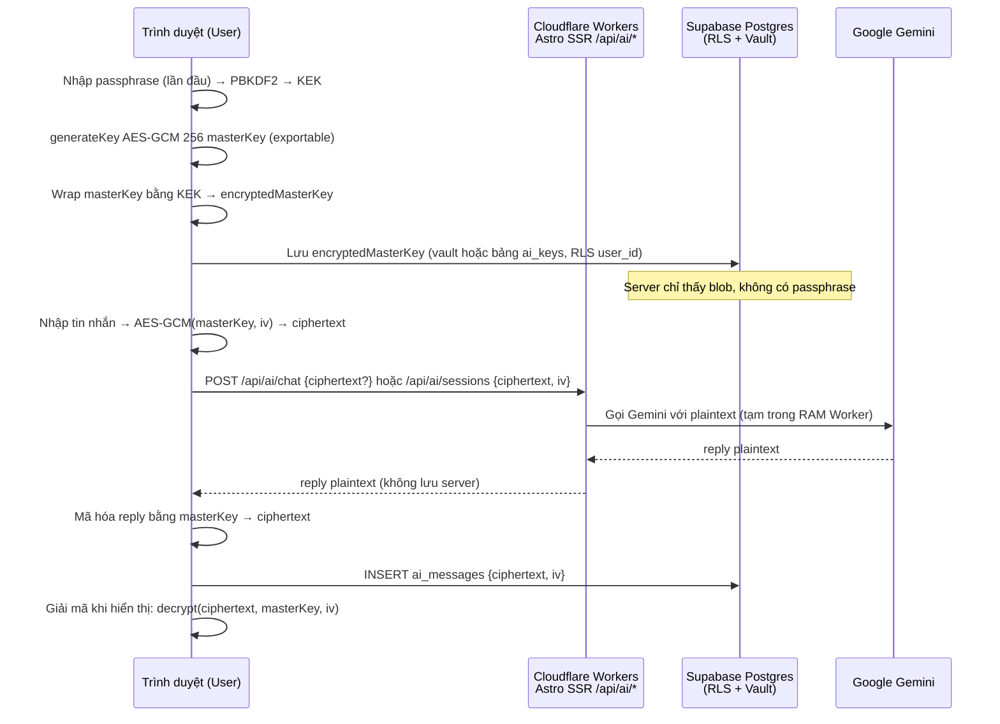

# Kế Hoạch Mã Hóa Toàn Diện & Lưu Trữ Bảo Mật Tính Năng AI — LovelyYellowCat

> **Trạng thái:** Kế hoạch chi tiết (chưa triển khai) · Ngày: 27/08/2026  
> **Phạm vi:** `https://lovelyyellowcat.nongtiensonpro.workers.dev/ai` — Trạm CAT_AI.EXE  
> **Mục tiêu:** Mã hóa **đầy đủ (end-to-end)** lịch sử hội thoại AI và lưu trữ **không thể đọc** trên Supabase — server kể cả khi bị rò rỉ DB cũng không đọc được nội dung.

---

## 0. Tóm Tắt Điều Hành

Hiện tại AI lưu **100% ở `localStorage`** (`src/components/AiChatStation.tsx:163-164` — `vapor_ai_chat_sessions_v2`, `user_gemini_api_key`) và gọi Gemini qua proxy `/api/ai/chat.ts:45` hoặc trực tiếp từ browser (`AiChatStation.tsx:191`). Không có bảng Supabase nào lưu chat, không có mã hóa, `user_gemini_api_key` nằm plaintext trong localStorage.

Kế hoạch này đề xuất **Zero-Knowledge E2EE**: mã hóa bằng **Web Crypto API — AES-GCM 256-bit** ngay trên trình duyệt trước khi `fetch` tới Supabase/Workers. Supabase chỉ lưu `ciphertext + iv + salt` (dạng Base64). Giải mã duy nhất ở thiết bị người dùng bằng khóa được dẫn xuất từ **passphrase** (PBKDF2 250.000 vòng, SHA-256). Server secrets (GEMINI_API_KEY) tách riêng vào **Supabase Vault** (`vault.secrets`), không dùng `pgsodium` trực tiếp (đang chờ deprecation).

**Tham chiếu nghiên cứu:**
- Supabase Vault là extension kế nhiệm `pgsodium`, tự quản lý root key 64-hex riêng từng project, giao diện `vault.secrets` / `vault.decrypted_secrets` — không khuyến nghị dùng `pgsodium` TCE/Server Key Management mới nữa.
- Web Crypto AES-GCM là chuẩn 2026 cho mã hóa client-side (mọi trình duyệt hiện đại hỗ trợ `crypto.subtle`, kể cả Cloudflare Workers qua `webcrypto`).

---

## 1. Phân Tích Hiện Trạng (`file_path:line_number`)

| Thành phần | Vị trí | Hiện trạng | Rủi ro |
|---|---|---|---|
| **UI / State** | `AiChatStation.tsx:282-383` | `sessions: ChatSession[]` lưu `localStorage` JSON thô | XSS đọc được toàn bộ, mất khi đổi thiết bị, không đồng bộ |
| **BYOK** | `AiChatStation.tsx:164,396-408` | `user_gemini_api_key` plaintext localStorage | Lộ key nếu XSS / trộm máy |
| **System key** | `src/pages/api/ai/config.ts:13` | Chỉ trả `hasKey:boolean` (đã vá) | Đúng — không lộ |
| **Proxy chat** | `api/ai/chat.ts:45-236` | `GEMINI_API_KEY` đọc từ `env` Cloudflare Workers | Key nằm trong Workers secrets — nên chuyển vào Vault thay vì env thô |
| **Direct client** | `AiChatStation.tsx:191-280` | `executeClientDirectChat` gọi `generativelanguage.googleapis.com` với key của user | Đúng cho BYOK, nhưng lịch sử gửi kèm vẫn plaintext |
| **Supabase** | `supabase_sql/supabase_master_latest.sql:1` | 14 bảng (profiles, articles, submissions...) — **chưa có bảng ai_** nào | Không có nơi lưu chat server-side |
| **Auth** | `src/lib/supabase.ts:43` | `getCurrentUserProfile` qua `@supabase/ssr` 0.12.4 | Có thể tái dùng cho RLS chat |
| **Runtime** | `astro.config.mjs:8`, `package.json:15` | `Astro 7 + @astrojs/cloudflare 14 + Cloudflare Workers` | Workers hỗ trợ `crypto.subtle` (node `uncrypto` đã có trong lockfile) |

**Kết luận:** Cần *tạo mới* hệ con lưu trữ mã hóa, không sửa logic Gemini hiện tại.

---

## 2. Mục Tiêu Mã Hóa "Đầy Đủ"

1. **Tính bảo mật:** Server/Supabase admin/attacker dump DB → không đọc được nội dung chat.
2. **Tính riêng tư:** Mỗi user chỉ đọc được phiên của mình (RLS `auth.uid() = user_id`).
3. **Tương thích:** Vẫn chạy trên **Astro SSR + Cloudflare Workers** (giới hạn $0).
4. **Trải nghiệm:** Không phá vỡ 4 persona, fallback model, temperature, history hiện tại.
5. **Tuân thủ:** Sẵn sàng cho GDPR “quyền xóa”, mã hóa at-rest mặc định của Supabase là *chưa đủ* nếu muốn zero-knowledge.

Loại trừ (ngoài phạm vi): mã hóa đầu-cuối giữa *hai user* với nhau (chỉ self-history).

---

## 3. So Sánh 3 Kiến Trúc (Quyết Định)

| Phương án | Mô tả | Ưu | Nhược | Khuyến nghị |
|---|---|---|---|---|
| **A. E2EE Client-Side (Web Crypto)** | Browser `AES-GCM` → Supabase lưu `ciphertext` | Server mù hoàn toàn, không phụ thuộc Vault | Mất passphrase = mất data, cần UI nhập PIN | **✅ Chọn làm mặc định** |
| **B. Server-Side TCE (Vault/pgsodium)** | Postgres tự mã hóa cột | Đơn giản, Supabase quản lý key | Supabase khuyên *không* dùng `pgsodium` TCE mới (pending deprecation); Vault chỉ cho `vault.secrets` (ít row), không tối ưu cho hàng nghìn message | Dùng **chỉ cho server secrets** (GEMINI_API_KEY) |
| **C. Hybrid (A+B)** | Client E2EE cho messages + Vault cho khóa hệ thống/API key | Kết hợp ưu điểm | Phức tạp vừa phải | **✅ Chọn C** — A cho chat, B cho secrets |

> Tham chiếu: Supabase docs “`pgsodium` (pending deprecation): Encryption Features — does NOT recommend any new usage, use Vault instead” và “Vault: Supabase Vault is a Postgres extension for managing secrets… `vault.secrets` / `decrypted_secrets`”.

---

## 4. Kiến Trúc Đề Xuất — Hybrid Zero-Knowledge

### 4.1 Tổng quan luồng



**Nguyên tắc:** Plaintext chỉ tồn tại trong RAM của trình duyệt và RAM ephemeral của Worker (để gọi Gemini). Đĩa Supabase chỉ có ciphertext.

### 4.2 Phân tách khóa (Key Hierarchy)

```
Passphrase (do user tự đặt, ví dụ 12 ký tự) 
  └─ PBKDF2 (salt 16B random, 250k iter, SHA-256) → KEK (AES-GCM 256, non-exportable)
       └─ Wrap: AES-KW hoặc AES-GCM(KEK, masterKey) → encryptedMasterKey (lưu Supabase)

masterKey (AES-GCM 256, exportable, random 32B, sinh 1 lần / user / thiết bị)
  └─ Encrypt mỗi message: AES-GCM(masterKey, iv 12B random) → ciphertext
```

*Vì sao cần 2 tầng?* Đổi passphrase chỉ cần re-wrap masterKey (1 row), không cần re-encrypt toàn bộ lịch sử. Đây là pattern "Encrypted sync + device keys" chuẩn 2026.

Thư viện: **Web Crypto API** thuần (`crypto.subtle`), không cần `libsodium` JS.

---

## 5. Mô Hình Dữ Liệu Supabase

### 5.1 Bảng mới — chạy trong `supabase_sql/supabase_ai_encrypted.sql` (đề xuất)

```sql
-- Bật Vault (dùng cho GEMINI_API_KEY, không cho chat E2EE)
create extension if not exists vault with schema vault;

-- 1) Khóa bọc của từng user (1 row / user)
create table if not exists public.ai_user_keys (
  user_id uuid primary key references auth.users(id) on delete cascade,
  encrypted_master_key text not null, -- Base64(ciphertext của masterKey được wrap bởi KEK)
  kek_salt text not null,             -- Base64(salt 16B cho PBKDF2)
  kek_iterations integer not null default 250000,
  created_at timestamptz default now(),
  updated_at timestamptz default now()
);

-- 2) Phiên chat (metadata KHÔNG mã hóa để sort/filter, nội dung nhạy cảm đã mã hóa ở bảng messages)
create table if not exists public.ai_sessions (
  id uuid primary key default gen_random_uuid(),
  user_id uuid not null references auth.users(id) on delete cascade,
  title_encrypted text not null, -- ciphertext của title (Base64)
  title_iv text not null,
  persona text not null check (persona in ('cybercat','art_critic','hacker','synth_dj')),
  created_at timestamptz default now(),
  updated_at timestamptz default now()
);
create index if not exists idx_ai_sessions_user on public.ai_sessions(user_id, updated_at desc);

-- 3) Tin nhắn (mỗi row = 1 message đã mã hóa)
create table if not exists public.ai_messages (
  id uuid primary key default gen_random_uuid(),
  session_id uuid not null references public.ai_sessions(id) on delete cascade,
  user_id uuid not null, -- denormalize để RLS đơn giản (check = auth.uid())
  role text not null check (role in ('user','model')),
  ciphertext text not null, -- Base64(AES-GCM ciphertext + auth tag)
  iv text not null,         -- Base64(12B iv)
  -- metadata không nhạy cảm (để UI không cần giải mã vẫn render khung)
  model_name text,
  is_error boolean default false,
  created_at timestamptz default now()
);
create index if not exists idx_ai_messages_session on public.ai_messages(session_id, created_at);
create index if not exists idx_ai_messages_user on public.ai_messages(user_id);

-- 4) Bảng kiểm định: lưu hash của plaintext để phát hiện giả mạo? Không cần vì AES-GCM đã authenticated.
```

**Kiểu lưu trữ:** `ciphertext` và `iv` dạng Base64 (như guide Web Crypto Toolkit: `btoa(String.fromCharCode(...new Uint8Array(buf)))`). Không lưu salt riêng per-message (salt chỉ cho KEK).

**Dung lượng ước tính:** Mỗi message ~1-2KB ciphertext + 24B iv → với 10k message ~20MB, trong hạn mức Supabase free 500MB.

### 5.2 Supabase Vault cho Server Secrets

Không lưu `GEMINI_API_KEY` trong `wrangler.jsonc` hay `.env` nữa:

```sql
-- Chạy bằng service_role (SQL Editor với quyền postgres)
select vault.create_secret('GEMINI_API_KEY_NONGTIENSONPRO', 'AIza...', 'Gemini cho LovelyYellowCat worker');
-- Đọc trong Worker/Edge Function:
-- select decrypted_secret from vault.decrypted_secrets where name = 'GEMINI_API_KEY_NONGTIENSONPRO';
```

Hoặc giữ trong Cloudflare Workers Secrets như hiện tại (`env.GEMINI_API_KEY` tại `api/ai/chat.ts:46`) — Vault là lựa chọn khi muốn xoay key không cần redeploy.

---

## 6. RLS & Quyền

```sql
alter table public.ai_user_keys enable row level security;
alter table public.ai_sessions enable row level security;
alter table public.ai_messages enable row level security;

-- Chỉ chủ sở hữu được đọc/ghi
create policy "Users manage own ai keys"
  on public.ai_user_keys for all to authenticated
  using (auth.uid() = user_id) with check (auth.uid() = user_id);

create policy "Users manage own sessions"
  on public.ai_sessions for all to authenticated
  using (auth.uid() = user_id) with check (auth.uid() = user_id);

create policy "Users manage own messages"
  on public.ai_messages for all to authenticated
  using (auth.uid() = user_id) with check (auth.uid() = user_id);

-- Service role bypass (để Vault/admin jobs nếu cần)
-- Không tạo policy cho anon — anon không thấy gì (khắc phục CVE-2025-48757: RLS disabled by default)
```

**Tham chiếu:** Supabase RLS guide và bài “170+ apps exposed by missing RLS” — bắt buộc `ENABLE ROW LEVEL SECURITY` + policies cho mọi bảng mới.

---

## 7. Luồng Mã Hóa / Giải Mã Chi Tiết

### 7.1 Lần đầu thiết lập (Onboarding)

1. User vào `/ai`, chưa có `ai_user_keys` → UI hiện modal “Đặt mật khẩu mã hóa (passphrase) — 8+ ký tự, không lưu trên server”.
2. Browser:
   ```ts
   // src/lib/aiCrypto.ts (mới)
   const salt = crypto.getRandomValues(new Uint8Array(16));
   const kek = await deriveKEK(passphrase, salt); // PBKDF2
   const masterKey = await crypto.subtle.generateKey({name:"AES-GCM", length:256}, true, ["encrypt","decrypt"]);
   const exported = await crypto.subtle.exportKey("raw", masterKey);
   const ivWrap = crypto.getRandomValues(new Uint8Array(12));
   const encryptedMasterKey = await crypto.subtle.encrypt({name:"AES-GCM", iv: ivWrap}, kek, exported);
   // Lưu: { encrypted_master_key: Base64(encryptedMasterKey), kek_salt: Base64(salt), ivWrap }
   ```
3. Lưu `encrypted_master_key + salt + ivWrap` lên `ai_user_keys` (RLS).
4. Lưu `masterKey` (CryptoKey non-exportable sau khi wrap? Hoặc giữ exportable trong IndexedDB) — ưu tiên **IndexedDB + `extractable:false`** để XSS khó đọc hơn localStorage.

### 7.2 Gửi tin nhắn (Encrypt)

```ts
// aiCrypto.ts
export async function encryptJson(obj: unknown, masterKey: CryptoKey) {
  const iv = crypto.getRandomValues(new Uint8Array(12));
  const plaintext = new TextEncoder().encode(JSON.stringify(obj)); // {content, persona...}
  const ciphertext = await crypto.subtle.encrypt({name:"AES-GCM", iv}, masterKey, plaintext);
  return { iv: toBase64(iv), ciphertext: toBase64(ciphertext) };
}
```

Trong `AiChatStation.tsx:410 handleSendMessage`:
- Trước khi `fetch("/api/ai/chat")`, vẫn gửi plaintext tới Worker để gọi Gemini (cần plaintext để LLM hiểu).
- **Song song:** `encryptJson({content, persona}, masterKey)` → `POST /api/ai/messages` lưu ciphertext.

> Biến thể “mã hóa cả trước khi gọi Gemini” (gửi ciphertext tới Worker rồi Worker giải mã bằng Vault key) → thêm độ trễ, không cần thiết vì Worker đã là trusted ephemeral. Giữ luồng hiện tại: browser → Worker (TLS) plaintext, chỉ Supabase at-rest là ciphertext.

### 7.3 Hiển thị lịch sử (Decrypt)

```ts
export async function decryptJson(payload: {iv:string,ciphertext:string}, masterKey: CryptoKey) {
  const iv = fromBase64(payload.iv);
  const ct = fromBase64(payload.ciphertext);
  const pt = await crypto.subtle.decrypt({name:"AES-GCM", iv}, masterKey, ct);
  return JSON.parse(new TextDecoder().decode(pt));
}
```

Khi load `/ai`:
- Fetch `ai_sessions` + `ai_messages` (ciphertext).
- Nếu có `masterKey` trong memory/IndexedDB → decrypt từng row → render.
- Nếu không (đổi thiết bị) → yêu cầu nhập lại passphrase → re-derive KEK → decrypt `encrypted_master_key` → khôi phục masterKey.

### 7.4 Đổi passphrase / Quên passphrase

- Đổi: re-derive KEK mới → re-wrap cùng masterKey → UPDATE `ai_user_keys`.
- Quên: **không thể khôi phục** (zero-knowledge). UI cảnh báo rõ + cung cấp “Xuất khóa khôi phục” (Base64 masterKey) để in ra giấy.

---

## 8. Thiết Kế API Mới

Giữ nguyên `GET /api/ai/config.ts:4` (chỉ `hasKey`) và `POST /api/ai/chat.ts:45` (proxy Gemini, không lưu).

Thêm (Astro API Routes, dùng `createSupabaseServerClient` tại `src/lib/supabase.ts:12`):

| Endpoint | Method | Auth | Body | Mô tả |
|---|---|---|---|---|
| `/api/ai/keys` | `PUT` | `authenticated` | `{encryptedMasterKey, kekSalt, kekIterations, ivWrap}` | Upsert `ai_user_keys` |
| `/api/ai/keys` | `GET` | `authenticated` | — | Lấy wrapped key để unwrap |
| `/api/ai/sessions` | `GET` | `authenticated` | `?limit&offset` | List sessions của user (RLS) |
| `/api/ai/sessions` | `POST` | `authenticated` | `{title_encrypted, title_iv, persona}` | Tạo phiên, trả `id` |
| `/api/ai/messages` | `POST` | `authenticated` | `{session_id, role, ciphertext, iv, model_name?}` | Lưu 1 message đã mã hóa |
| `/api/ai/messages` | `GET` | `authenticated` | `?session_id` | Lấy messages (ciphertext) của 1 phiên |
| `/api/ai/sessions/:id` | `DELETE` | `authenticated` | — | Xóa phiên + cascade messages (RLS đảm bảo chỉ xóa của mình) |

Tất cả đều `Cache-Control: no-store` và kiểm tra `auth.uid()` ở RLS.

---

## 9. Tích Hợp Frontend (`AiChatStation.tsx`)

**File mới:** `src/lib/aiCrypto.ts` — chứa `toBase64/fromBase64`, `deriveKEK`, `generateMasterKey`, `wrapMasterKey`, `unwrapMasterKey`, `encryptJson`, `decryptJson` (dùng `crypto.subtle`, hỗ trợ cả Workers qua `uncrypto` đã có trong `package-lock.json:3868` nếu cần fallback).

**Refactor `AiChatStation.tsx`:**

- `STORAGE_KEY = "vapor_ai_chat_sessions_v2"` (`:163`) → giữ làm **cache offline** nhưng chuyển từ plaintext JSON sang **ciphertext JSON** (hoặc xóa hẳn, chỉ dùng Supabase).
- Thêm state `masterKey: CryptoKey | null` và `isUnlocked: boolean`.
- Thêm modal passphrase (tái dùng `Win95Window.tsx:1`) hiện khi `!isUnlocked && sessions.length>0`.
- `useEffect` khởi động (`:338`): thay vì `localStorage.getItem(STORAGE_KEY)` → fetch `/api/ai/sessions` → decrypt.
- `handleSendMessage` (`:411`): sau khi nhận `result.reply` → encrypt cả `userMsg` và `modelMsg` → POST `/api/ai/messages`.
- `userCustomApiKey` (`:302`): cũng mã hóa bằng cùng `masterKey` trước khi lưu Supabase (thay vì plaintext `API_KEY_STORAGE`). Hoặc chuyển vào `vault.secrets` nếu muốn server quản lý?
- Thêm nút “Khóa phiên” (lock) để xóa `masterKey` khỏi RAM khi rời máy công.

**Tương thích ngược:** Nếu user cũ có data localStorage plaintext, migration 1 lần: decrypt? Không có key cũ → Import: đọc localStorage, encrypt bằng masterKey mới, upload, xóa localStorage plaintext.

---

## 10. Bảo Mật Bổ Sung (Không Thể Thiếu)

1.  **XSS là kẻ thù số 1 của E2EE browser:** Dùng `Content-Security-Policy` header trong `BaseLayout.astro` (Astro SSR) và escape `formatMarkdown` (`AiChatStation.tsx:652`) — hiện đang dùng `dangerouslySetInnerHTML` với replace thô, cần sanitize bằng `DOMPurify` hoặc `marked` + `sanitize`.
2.  **Không lưu `masterKey` ở `localStorage`:** Dùng `IndexedDB` với `extractable: false` hoặc chỉ giữ trong RAM, yêu cầu nhập lại passphrase sau khi đóng tab.
3.  **Rate limit:** Giữ trigger `check_comment_rate_limit` mẫu, thêm trigger tương tự cho `ai_messages` (ví dụ 20 msg / phút / user) tại `supabase_sql/supabase_master_latest.sql:786`.
4.  **Audit & Retention:** Thêm bảng `ai_audit_log` hoặc mở rộng `admin_audit_log:293` để log `ai_message_created` (không log nội dung). Cho phép user “Xóa toàn bộ lịch sử” → `DELETE FROM ai_sessions WHERE user_id = auth.uid()` (cascade).
5.  **Vault cho GEMINI_API_KEY:** Như mục 5.2, di chuyển khỏi `wrangler.jsonc:11` / `.dev.vars` sang `vault.create_secret`.

---

## 11. Tương Thích Astro + Cloudflare Workers

- **Web Crypto API:** Có sẵn trong Workers (`crypto.subtle`) và mọi trình duyệt hiện đại (Chrome, Firefox, Safari, Edge). Trong Worker SSR, nếu cần, dùng `uncrypto` (`package-lock.json:3868`) làm polyfill — nhưng Astro 7 trên Workers đã hỗ trợ native.
- **Build:** Không thêm dependency nặng; `src/lib/aiCrypto.ts` thuần `crypto.subtle`.
- **Performance:** AES-GCM trên payload <2KB ~1-3ms (theo benchmark DevToolkit 2026). Không ảnh hưởng TTFB.

---

## 12. Lộ Trình Triển Khai (Đề Xuất 3 Pha)

### Pha 0 — Chuẩn bị (0.5 ngày)
- [ ] Tạo branch `feature/ai-e2ee`
- [ ] Chạy `create extension if not exists vault` trên Supabase SQL Editor
- [ ] Code review `AiChatStation.tsx` hiện tại, viết test cho `aiCrypto.ts`

### Pha 1 — MVP E2EE (2-3 ngày) — **Khuyên triển khai trước**
- [ ] Tạo migration `supabase_ai_encrypted.sql` (3 bảng + RLS + index)
- [ ] Viết `src/lib/aiCrypto.ts`
- [ ] Tạo 4 API routes `/api/ai/keys` + `/sessions` + `/messages`
- [ ] Thêm modal passphrase + logic wrap/unwrap masterKey vào `AiChatStation.tsx`
- [ ] UI “Đang mã hóa…” / “Đã khóa” (dùng `RetroSticker.astro`, `Win95Window.tsx`)
- [ ] Kiểm thử E2EE: tạo 2 user, đảm bảo user A không đọc được ciphertext của B qua anon key (RLS)

### Pha 2 — Củng cố (1-2 ngày)
- [ ] Chuyển `GEMINI_API_KEY` vào Vault, sửa `api/ai/chat.ts:46` để đọc từ `vault.decrypted_secrets` (service_role)
- [ ] Mã hóa `user_gemini_api_key` (BYOK) bằng cùng masterKey thay vì plaintext
- [ ] Thêm “Xuất khóa khôi phục” + “Đổi passphrase” + “Xóa toàn bộ”
- [ ] Thêm trigger rate limit cho `ai_messages`

### Pha 3 — Hoàn thiện & Kiểm định (1 ngày)
- [ ] Viết Playwright/Cypress E2E: tạo phiên → reload → nhập passphrase → thấy lại lịch sử
- [ ] Kiểm định bảo mật: thử XSS đọc IndexedDB, thử anon key đọc bảng khác, thử Vault RLS
- [ ] Cập nhật `tailieu/` và `README.md:232` (mô tả Trạm AI mới)

---

## 13. Rủi Ro & Giảm Thiểu

| Rủi ro | Giảm thiểu |
|---|---|
| Quên passphrase → mất toàn bộ lịch sử | Cảnh báo UI + nút “In khóa khôi phục” (Base64 masterKey) + cho phép “Bỏ mã hóa, lưu plaintext” như opt-out |
| Supabase deprecate `pgsodium` | **Không dùng `pgsodium` trực tiếp** — chỉ dùng `vault` (Supabase cam kết Vault không bị ảnh hưởng) |
| Worker không có `crypto.subtle` | Fallback `uncrypto` (đã có trong lockfile) |
| User đổi thiết bị | Lưu `encrypted_master_key` trên Supabase → thiết bị mới chỉ cần nhập lại passphrase để khôi phục |
| Hiệu năng với lịch sử dài | Phân trang `GET /api/ai/messages?session_id&limit=50`, decrypt lazy theo viewport (`client:visible` đã dùng ở `ai.astro:52`) |

---

## 14. Ví Dụ Mã Nguồn Tham Chiếu

### `src/lib/aiCrypto.ts` (trích)

```ts
const enc = new TextEncoder(), dec = new TextDecoder();
const toB64 = (buf: ArrayBuffer) => btoa(String.fromCharCode(...new Uint8Array(buf)));
const fromB64 = (b64: string) => Uint8Array.from(atob(b64), c => c.charCodeAt(0)).buffer;

export async function deriveKEK(passphrase: string, salt: Uint8Array) {
  const base = await crypto.subtle.importKey("raw", enc.encode(passphrase), "PBKDF2", false, ["deriveKey"]);
  return crypto.subtle.deriveKey(
    { name: "PBKDF2", salt, iterations: 250_000, hash: "SHA-256" },
    base, { name: "AES-GCM", length: 256 }, false, ["encrypt", "decrypt"]
  );
}
export async function encryptJson(obj: unknown, key: CryptoKey) {
  const iv = crypto.getRandomValues(new Uint8Array(12));
  const pt = enc.encode(JSON.stringify(obj));
  const ct = await crypto.subtle.encrypt({ name: "AES-GCM", iv }, key, pt);
  return { iv: toB64(iv), ciphertext: toB64(ct) };
}
```

### `vault` — tạo secret cho Gemini (SQL, chạy bằng service_role)

```sql
select vault.create_secret('GEMINI_API_KEY_NONGTIENSONPRO', 'AIza...', 'Gemini cho LovelyYellowCat');
-- Trong Worker (service_role):
select decrypted_secret from vault.decrypted_secrets where name = 'GEMINI_API_KEY_NONGTIENSONPRO';
```

---

## 15. Tài Liệu Tham Khảo

- Supabase Vault — Secrets and Encryption: `supabase.com/docs/guides/database/vault` (Vault dùng TCE riêng, không phụ thuộc `pgsodium`; mỗi project có root key 64-hex riêng).
- `pgsodium` pending deprecation: `supabase.com/docs/guides/database/extensions/pgsodium` — *“Supabase does not recommend any new usage of pgsodium… Use Vault instead.”*
- Web Crypto API Client-Side Encryption (2026 Guide) — DevToolKit, 24/02/2026 — AES-GCM + PBKDF2 250k iter + Base64 serialize.
- Supabase RLS Complete Guide — GuardLayer 01/07/2026 (CVE-2025-48757: 10.3% Lovable apps lộ data vì RLS off).
- LovelyYellowCat hiện trạng: `src/components/AiChatStation.tsx:163` (STORAGE_KEY), `:302` (API_KEY_STORAGE), `src/pages/api/ai/chat.ts:45` (proxy Gemini), `supabase_sql/supabase_master_latest.sql:292` (audit log).

---

## 16. Quyết Định Cần Bạn Xác Nhận Trước Khi Code

1.  **Passphrase bắt buộc hay tùy chọn?** Đề xuất: tùy chọn — user có thể chọn “Lưu không mã hóa (nhanh)” hoặc “Mã hóa E2EE (an toàn)”.
2.  **Thời hạn lưu trữ:** Mặc định giữ vĩnh viễn đến khi user xóa, hay auto-xóa sau 90 ngày (như Ministry Chat)?
3.  **Có cho phép Admin đọc lịch sử AI của user không?** Với E2EE: **không** (zero-knowledge). Nếu cần moderation, phải chấp nhận lưu *hash* hoặc cho user report thủ công.
4.  **Đặt tên file migration:** `supabase_sql/supabase_ai_encrypted.sql` OK chứ?

> Khi bạn duyệt kế hoạch này, tôi sẽ triển khai ngay Pha 1 (MVP) trên branch mới — toàn bộ thay đổi đều **build được trên `astro build` + `wrangler deploy`** với stack hiện tại, không thêm chi phí $0.
