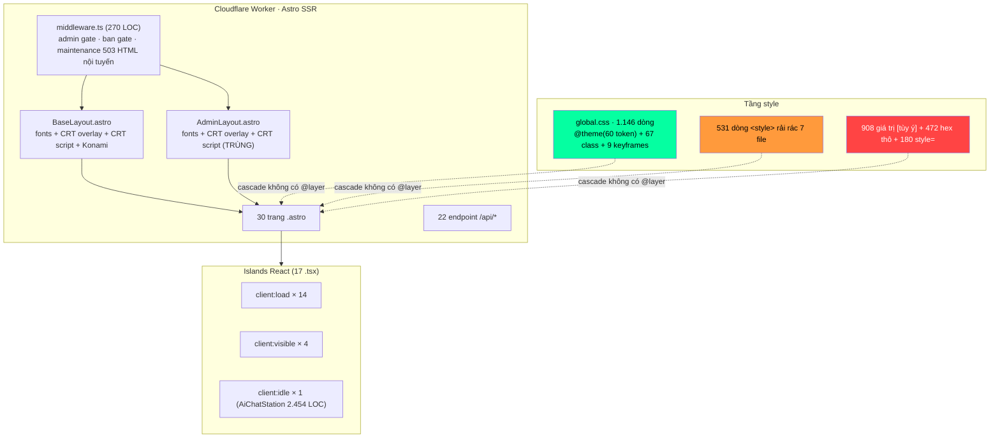
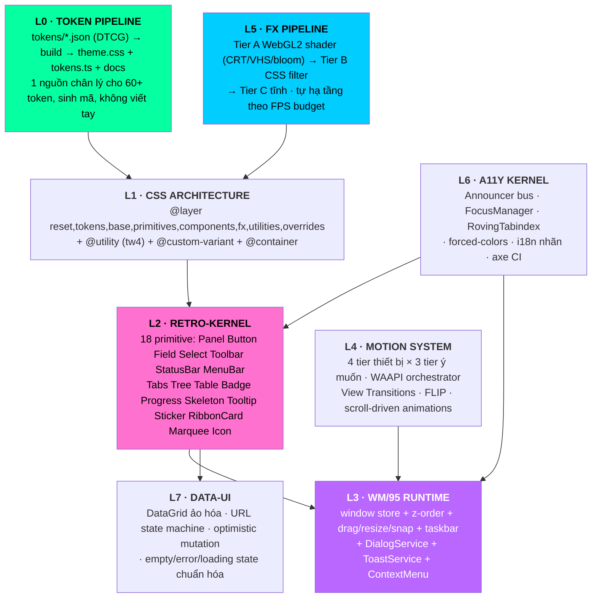

# 📼 KẾ HOẠCH NÂNG CẤP TOÀN DIỆN GIAO DIỆN — LOVELYYELLOWCAT **v4 "OVERDRIVE"**
### Bản thiết kế kỹ thuật cấp hệ thống cho tầng trình bày · Chấp nhận Over-Engineering có chủ đích

| | |
|---|---|
| **Repo** | `D:\lovelyyellowcat` — branch `main`, HEAD `3bf473f`, working tree sạch |
| **Stack đo được** | Astro **7.2.2** (`output: "server"`) · adapter `@astrojs/cloudflare` **14.2.1** · React **19.2.8** · Tailwind CSS **4.3.3** (`@theme`, không file config) · Supabase SSR · Cloudinary · Gemini |
| **Quy mô tầng UI** | 30 trang `.astro` · 22 endpoint API · 30 component (13 `.astro` + 17 `.tsx`) · **25.336 LOC** trong `src/` · `global.css` **1.146 dòng** |
| **Trạng thái build** | `npx astro sync` → **rc=0**, types sinh trong 1,55s (đã chạy thực tế khi khảo sát) |
| **Tài liệu tiền nhiệm** | `tailieu/Ke_hoach_nang_cap_UI_v3.md` (GĐ 0→5 đã tick hoàn thành 22/08/2026) · `DESIGN-dell-1996.md` · `Vaporwave_Design_System_va_Responsive_CSS.md` |
| **Phạm vi văn bản này** | Tầng trình bày: design system, kiến trúc CSS, component kernel, runtime cửa sổ, motion, FX, a11y, hiệu năng UI, quality gate. **Không** đổi schema nghiệp vụ, **không** đổi provider hạ tầng. |
| **Nguyên tắc bất biến** | ① Không phá bản sắc Win95 × Dell-1996 × Vaporwave. ② Không rời free-tier. ③ Mỗi hạng mục phải **đo được** trước/sau. ④ Mọi tầng mới phải có đường lùi (fallback) và cờ tắt. |

---

## MỤC LỤC

| § | Nội dung | § | Nội dung |
|---|---|---|---|
| **0** | Phương pháp khảo sát & bằng chứng số | **10** | L6 — Kiến trúc A11y có chủ đích |
| **1** | Bản đồ kiến trúc hiện trạng | **11** | L7 — Data-UI: DataGrid ảo hóa & Dialog/Toast Service |
| **2** | Chẩn đoán: 26 phát hiện có bằng chứng | **12** | Kỹ nghệ hiệu năng UI (ảnh · video · bundle · CSS) |
| **3** | Tầm nhìn v4 & 8 trụ cột kỹ thuật | **13** | Quality Gates: 9 cổng chặn tự động |
| **4** | L0 — Token Pipeline chuẩn DTCG | **14** | Chiến lược di trú & codemod |
| **5** | L1 — Kiến trúc CSS phân tầng `@layer` | **15** | Lộ trình 10 sprint |
| **6** | L2 — Primitive Kernel (RETRO-KERNEL) | **16** | Sổ đăng ký rủi ro |
| **7** | L3 — Window Manager runtime `WM/95` | **17** | Định nghĩa Hoàn thành & bảng chỉ tiêu |
| **8** | L4 — Motion System phân tầng | **18** | Phụ lục A–F (bảng công việc từng file, ADR, keymap…) |
| **9** | L5 — FX Pipeline: CRT/WebGL 3 tầng suy giảm | | |

---

# 0 · PHƯƠNG PHÁP KHẢO SÁT & BẰNG CHỨNG SỐ

Toàn bộ số liệu dưới đây **đo trực tiếp trên cây mã nguồn**, không suy đoán. Công cụ: quét AST-lite bằng regex trên 96 file `src/**/*.{astro,tsx,ts,css}`, đọc `dist/` sau build, `git log`, và `npx astro sync` thực thi.

### 0.1. Bảng chỉ số nền (baseline metrics)

| # | Chỉ số | Giá trị đo được | Ý nghĩa |
|---|---|---|---|
| M-01 | LOC tầng UI (`src/`) | **25.336** | Quy mô phải di trú |
| M-02 | `global.css` | **1.146 dòng**, 60 biến `--*`, 67 class, 9 `@keyframes` | Trái tim design system |
| M-03 | CSS nội tuyến trong `<style>` của `.astro` | **531 dòng** rải ở 7 file (about.astro 248, BannedNotice 112, UnauthorizedAccess 101…) | CSS ngoài tầm kiểm soát của token |
| M-04 | **Mã hex thô trong `.astro`/`.tsx`** | **472 lần** trên 40+ file (UserManagementActions 57, ServerStatusWidget 45, GalleryLightbox 35, AiChatStation 32) | Vi phạm trực tiếp quy tắc "cấm hex trong component" ghi trong README |
| M-05 | Giá trị Tailwind tùy ý `[...]` | **908 lần** | Token bị bỏ qua, không thể refactor an toàn |
| M-06 | Thuộc tính `style=` nội tuyến | **180 lần** | Chủ yếu để vá `min-height: 32px` cho touch target |
| M-07 | `z-[9999]`/`z-[99999]` ad-hoc | **11 nơi** ở 8 file, trong khi thang `--z-*` 9 tầng **đã tồn tại** nhưng chỉ dùng **4 lần** | Thang z-index tồn tại nhưng không được thực thi |
| M-08 | `alert()` / `confirm()` gốc trình duyệt | **12 + 12 = 24 lần** (AiChatStation 8 alert, admin/trash 3 confirm…) | Rò rỉ UI hệ điều hành thật, phá vỡ ảo giác Win95 |
| M-09 | `role="dialog"` + `aria-modal` | Chỉ **3 nơi** (GalleryLightbox, SearchModal, admin/media) | Các modal/drawer còn lại không có semantics |
| M-10 | `aria-live` | **2 lần**, duy nhất trong `about.astro` | Mọi thay đổi async khác đều "im lặng" với screen reader |
| M-11 | `:focus-visible` trong component | **0** (chỉ có 7 lần trong `global.css`) | Không có chuẩn focus ring cho island React |
| M-12 | `srcset` / `decoding="async"` | **0 / 0** trên tổng **51 thẻ ``**; chỉ 1 thẻ có `width` | Không có ảnh responsive dù đã dùng Cloudinary |
| M-13 | Video hero | `public/videos/hero-bg.mp4` = **6.272 KB** phục vụ từ Worker | Ngốn băng thông edge, ảnh hưởng LCP mobile |
| M-14 | Bundle client lớn nhất | `supabaseBrowser.*.js` **203,4 KB** · `client.*.js` **176,4 KB** · `AiChatStation.*.js` **38,6 KB** · CSS `BaseLayout.*.css` **99,6 KB** | CSS 99,6 KB cho *một* layout = chưa tách theo route |
| M-15 | Chỉ thị hydration | `client:load` **14** · `client:visible` **4** · `client:idle` **1** | Nghiêng nặng về `load` — 14 island tải ngay |
| M-16 | Khối `<script>` nội tuyến trong `.astro` | **22 khối** ở 18 file; `document.querySelector/getElementById` **128 lần** | Logic UI vanilla rải rác, không test được |
| M-17 | Class định nghĩa nhưng **không dùng** | **15/67** (`input-vapor`, `select-vapor`, `textarea-vapor`, `label-vapor`, `progress-vapor`, `progress-fill`, `skeleton-win`, `btn-neon-primary`, `btn-ghost-neon`, `text-neon-pulse`, `win95-flat`, `input-ok`, `input-error`, `animate-cassette-spin`, `cassette-paused`) | Design system đã xây primitive nhưng **component không tiêu thụ** — đây là nguyên nhân gốc của M-04/M-05 |
| M-18 | `: any` trong tầng UI | **155 lần** (AiChatStation 11, admin/media 9, api/ai/chat 7…) | Props component không có hợp đồng kiểu |
| M-19 | CSS hiện đại: `@layer`, `@utility`, `@container`, `:has()`, `@supports`, `dvh`, `safe-area-inset`, `color-scheme`, `forced-colors`, `prefers-contrast`, `content-visibility`, `aspect-ratio`, `@font-face` | **tất cả = 0** | Đang dùng Tailwind v4 nhưng viết CSS theo tư duy v3; bỏ trắng toàn bộ năng lực CSS 2024–2026 |
| M-20 | Hạ tầng chất lượng | **Không có** ESLint, Prettier, Stylelint, Vitest, Playwright, Storybook, Lighthouse CI, knip, `.editorconfig` | 0 cổng chặn tự động; mọi quy tắc design system chỉ là lời hứa trong README |
| M-21 | View Transitions / `ClientRouter` | **0** | Điều hướng là full page reload — nghịch lý với ý tưởng "hệ điều hành" |
| M-22 | Trùng lặp khung `win95-container` | **110 lần**, `win95-btn` **288 lần**, `win95-header` **98 lần** viết tay | Không có component bọc → mỗi lần sửa chrome phải sửa 110 chỗ |
| M-23 | Trùng lặp shell layout | `BaseLayout` và `AdminLayout` **đều tự** nhúng link Google Fonts, lớp phủ CRT, script `vapor_crt_mode` | 2 nguồn chân lý cho cùng một hệ thống |
| M-24 | Bảng dữ liệu admin | **6 `<table>`** thô, chỉ **2** dùng `.win-table`; 4 thanh phân trang, 4 form filter GET — copy-paste | Chi phí sửa lỗi × 4–6 |
| M-25 | `localStorage` keys | 3 key (`lyc_boot_seen_v1`, `hero-video-paused`, `vapor_crt_mode`) đọc/ghi trực tiếp ở 10 nơi | Không có tầng persistence/preference tập trung |
| M-26 | Font | 3 họ nạp qua Google Fonts CDN, `@font-face` tự chủ = 0, không `font-display` tùy biến, không subset tiếng Việt cục bộ | Render-blocking bên thứ ba + FOUT |

### 0.2. Kết luận khảo sát

Dự án **không** thiếu ý tưởng thiết kế — nó có một design system được **viết ra** rất tốt (60 token, 67 primitive, tài liệu 48K ký tự). Vấn đề là **khoảng cách thực thi**: 15 primitive chưa ai dùng, 472 hex thô, 908 giá trị tùy ý, 0 cổng chặn tự động. Đây là bệnh "design system không có tầng cưỡng chế".

> **Luận điểm trung tâm của v4:** không vẽ lại giao diện. **Xây tầng cưỡng chế + kernel component + runtime**, rồi để codemod kéo 25.336 LOC vào khuôn. Vẻ đẹp là hệ quả của kiến trúc, không phải của thêm hiệu ứng.

---

# 1 · BẢN ĐỒ KIẾN TRÚC HIỆN TRẠNG

### 1.1. Sơ đồ tầng render



### 1.2. Phân loại 30 component theo mức nợ kỹ thuật UI

| Nhóm | Component | LOC | Hex thô | `[tùy ý]` | Nợ chính |
|---|---|---|---|---|---|
| 🔴 **Khổng lồ** | `AiChatStation.tsx` | 2.454 | 32 | 96 | 8 `alert()`, 4 `z-[9999]`, 11 `:any`, 1 file = 20 trách nhiệm |
| 🔴 | `GalleryLightbox.tsx` | 1.112 | 35 | 67 | 7 shader viết bằng CSS filter chuỗi, class string 231 ký tự |
| 🔴 | `ServerStatusWidget.astro` | 773 | 45 | 90 | Toàn bộ màu hard-code, script vanilla 1 khối |
| 🟠 **Trang nặng** | `articles/[slug].astro` | 891 | – | 19 | 22 `style=`, TOC scrollspy vanilla |
| 🟠 | `about.astro` | 714 | – | – | 248 dòng CSS nội tuyến |
| 🟠 | `admin/media.astro` | 599 | 14 | 32 | 2 `confirm()`, table thô, dialog tự vẽ |
| 🟡 **Đã tốt** | `Win95Window.tsx` | 116 | 0 | 0 | Đúng hướng nhưng **không có** `role=dialog`, không kéo/thả, không z-order → chỉ là vỏ tĩnh |
| 🟡 | `SearchModal.tsx` | 302 | 1 | – | Có `useFocusTrap` + `aria-modal` ✅ — mẫu hình để nhân bản |
| 🟢 **Hạ tầng** | `lib/a11y.ts` | 74 | – | – | `useFocusTrap` tốt nhưng dùng ở **2/12** modal |

### 1.3. Điều gì đang giữ hệ thống lại

1. **Không có kernel.** `Win95Window.tsx` tồn tại nhưng 110 lần `win95-container` viết tay chứng minh nó không được coi là nguồn chân lý.
2. **Không có runtime.** Ý tưởng "admin là hệ điều hành" nhưng cửa sổ không kéo được, không có z-order, không có taskbar thật, không minimize được. Đó là **ảnh chụp** của một OS, không phải OS.
3. **Không có cưỡng chế.** 0 linter → mỗi commit là một cơ hội để hex thô sinh sôi.
4. **Không có đo lường.** Không Lighthouse CI, không axe, không visual regression → không biết đẹp/nhanh/tiếp cận được hơn hay kém đi.

---

# 2 · CHẨN ĐOÁN: 26 PHÁT HIỆN CÓ BẰNG CHỨNG

Mỗi phát hiện gắn mã `F-xx`, mức nghiêm trọng, bằng chứng đo được, và **nguyên nhân gốc** (không chỉ triệu chứng).

## 2.1. Nhóm A — Design System bị bỏ rơi (nghiêm trọng nhất)

| Mã | Mức | Phát hiện | Bằng chứng | Nguyên nhân gốc |
|---|---|---|---|---|
| **F-01** | 🔴 P0 | 472 mã hex thô trong component dù README tuyên bố "cấm hex trực tiếp" | `UserManagementActions.tsx` 57, `ServerStatusWidget.astro` 45, `GalleryLightbox.tsx` 35 | Không có Stylelint/ESLint chặn; token không phủ hết use case (thiếu token viền, glow, overlay) |
| **F-02** | 🔴 P0 | 15/67 primitive định nghĩa mà **không component nào dùng** | `input-vapor`, `select-vapor`, `textarea-vapor`, `label-vapor`, `progress-vapor`, `skeleton-win`, `btn-neon-primary`… | Primitive được thêm ở GĐ1 v3 nhưng **không có bước di trú** kèm theo; không ai biết chúng tồn tại |
| **F-03** | 🔴 P0 | 908 giá trị Tailwind tùy ý `[…]` | Tập trung ở 3 file khổng lồ | Thiếu spacing/size scale trong `@theme`; thiếu `@utility` |
| **F-04** | 🟠 P1 | 531 dòng CSS nội tuyến ngoài tầm token | `about.astro` 248, `BannedNotice` 112, `UnauthorizedAccessNotice` 101 | Không có nơi đặt "CSS theo trang"; cascade không phân tầng |
| **F-05** | 🟠 P1 | 180 `style=` nội tuyến, phần lớn là `min-height: 32px/22px/38px` | `UserManagementActions.tsx` 35, `articles/[slug].astro` 22 | Không có token/utility cho **touch target**; `win95-btn` không tự đảm bảo 44px |
| **F-06** | 🟠 P1 | Thang `--z-*` 9 tầng có sẵn nhưng dùng 4 lần, còn 11 `z-[9999]` ad-hoc | 8 file vi phạm | Không có utility `z-modal`/`z-toast` trong `@theme`; viết `z-[var(--z-modal)]` quá dài nên người ta bỏ |
| **F-07** | 🟡 P2 | 0 `@layer`, 0 `@utility`, 0 `@custom-variant` dù đang dùng Tailwind **v4.3.3** | Toàn bộ `global.css` | Viết CSS theo tư duy v3; specificity chiến tranh ngầm |

## 2.2. Nhóm B — Không có kernel component

| Mã | Mức | Phát hiện | Bằng chứng | Nguyên nhân gốc |
|---|---|---|---|---|
| **F-08** | 🔴 P0 | Chrome Win95 nhân bản thủ công: `win95-container` 110, `win95-btn` 288, `win95-header` 98 | Toàn repo | `Win95Window.tsx` chỉ là 1 biến thể; không có `Button`, `Panel`, `Field`, `Toolbar`, `StatusBar` |
| **F-09** | 🟠 P1 | 2 layout shell tự nhân bản fonts + CRT overlay + script `vapor_crt_mode` | `BaseLayout.astro` & `AdminLayout.astro` | Thiếu `RootShell` chung; 2 nguồn chân lý |
| **F-10** | 🟠 P1 | 6 `<table>` thô nhưng chỉ 2 dùng `.win-table`; 4 pagination + 4 filter form copy-paste | 5 trang admin | Không có `DataGrid` component; mỗi trang tự dựng lại |
| **F-11** | 🟡 P2 | 155 `: any` ở tầng UI | `AiChatStation` 11, `admin/media` 9 | Props không có interface; `userProfile?: any` lan truyền khắp layout |

## 2.3. Nhóm C — Ảo giác "hệ điều hành" chưa hoàn tất

| Mã | Mức | Phát hiện | Bằng chứng | Nguyên nhân gốc |
|---|---|---|---|---|
| **F-12** | 🔴 P0 | **24 lần `alert()`/`confirm()` gốc trình duyệt** | 12 alert + 12 confirm; `AiChatStation` 8, `admin/trash` 3 | Không có Dialog Service; đường tắt rẻ nhất khi cần hỏi người dùng |
| **F-13** | 🟠 P1 | Cửa sổ không kéo được, không z-order, không minimize thật, taskbar không phản chiếu cửa sổ mở | `Win95Window.tsx` chỉ toggle `isMinimized` cục bộ | Thiếu Window Manager (store + reducer + portal) |
| **F-14** | 🟠 P1 | 0 View Transitions → mỗi điều hướng là full reload, mất trạng thái CRT/nhạc | Không có `ClientRouter` | Chưa nâng lên mô hình SPA-lite của Astro |
| **F-15** | 🟡 P2 | 3 key `localStorage` đọc/ghi trực tiếp tại 10 nơi, không đồng bộ giữa tab | `vapor_crt_mode` 4, `hero-video-paused` 4, `lyc_boot_seen_v1` 2 | Không có Preference Store |
| **F-16** | 🟡 P2 | 22 khối `<script>` nội tuyến + 128 lần `document.querySelector` | 18 file `.astro` | Không có behavior layer (custom element/directive) |

## 2.4. Nhóm D — A11y dưới ngưỡng tuyên bố

| Mã | Mức | Phát hiện | Bằng chứng | Nguyên nhân gốc |
|---|---|---|---|---|
| **F-17** | 🔴 P0 | `useFocusTrap` chỉ dùng ở **2/12** overlay | `SearchModal`, `GalleryLightbox` có; `AiChatStation`, `ProfileEditor`, `SubmissionWizard`, các dialog admin **không** | Không có `<Modal>` bọc sẵn hành vi |
| **F-18** | 🔴 P0 | `aria-live` chỉ 2 lần, duy nhất `about.astro` | 46 lời gọi `fetch` không thông báo kết quả | Không có Announcer service |
| **F-19** | 🟠 P1 | 0 `:focus-visible` trong component; ring focus không nhất quán | `global.css` có 7 nhưng island tự vẽ | Thiếu token `--ring-*` + utility |
| **F-20** | 🟠 P1 | Titlebar giả là `<div>` mang chữ; nút `_ □ ✕` chỉ có `aria-label` tiếng Anh trong app tiếng Việt | `Win95Window.tsx` | Chưa có ADR về ngôn ngữ nhãn a11y |
| **F-21** | 🟡 P2 | 0 `forced-colors`, 0 `prefers-contrast` | `global.css` | Chưa xét chế độ High Contrast của Windows — trớ trêu cho một theme Win95 |

## 2.5. Nhóm E — Hiệu năng tầng trình bày

| Mã | Mức | Phát hiện | Bằng chứng | Nguyên nhân gốc |
|---|---|---|---|---|
| **F-22** | 🔴 P0 | Video hero **6,27 MB** phục vụ từ Worker; không `srcset`, không `decoding`, 1/51 `` có `width` | `public/videos/hero-bg.mp4`; M-12 | Không có `<Picture>`/`cldUrl()` helper bắt buộc |
| **F-23** | 🔴 P0 | CSS 1 layout = **99,6 KB**; `supabaseBrowser` **203,4 KB** trên client | `dist/client/_astro/*` | Không tách CSS theo route; supabase-js đầy đủ vào bundle công khai |
| **F-24** | 🟠 P1 | 14 `client:load` (vs 4 `visible`, 1 `idle`) | M-15 | Mặc định chọn `load` vì "chắc chắn chạy" |
| **F-25** | 🟠 P1 | 3 họ font từ Google CDN, 0 `@font-face` tự chủ, không subset tiếng Việt | `BaseLayout`+`AdminLayout` | Chưa self-host; render-blocking bên thứ ba |
| **F-26** | 🟡 P2 | 0 `content-visibility`, 0 `aspect-ratio` → CLS ở gallery masonry | `global.css`, `GalleryGrid.tsx` | Chưa dùng CSS containment |

## 2.6. Ma trận ưu tiên (Tác động × Chi phí)

```
Tác động
  cao │ F-01 F-08 F-12 F-22        │ F-13 F-14 F-23
      │ (P0 · làm ngay)            │ (P0 · cần kiến trúc)
      ├────────────────────────────┼────────────────────────
      │ F-05 F-06 F-17 F-18 F-24   │ F-02 F-04 F-10 F-25
  vừa │ (P1 · codemod được)        │ (P1 · di trú từng file)
      ├────────────────────────────┼────────────────────────
  thấp│ F-19 F-20 F-15             │ F-07 F-11 F-16 F-21 F-26
      └────────────────────────────┴────────────────────────
         chi phí thấp                  chi phí cao
```

---

# 3 · TẦM NHÌN v4 & 8 TRỤ CỘT KỸ THUẬT

## 3.1. Tuyên ngôn

> **v3 đã vẽ xong bộ mặt. v4 xây bộ xương và hệ thần kinh.**
>
> LovelyYellowCat v4 không phải "website có theme Win95". Nó là **một hệ điều hành ảo chạy trên edge**: có kernel (primitive), có window manager (runtime cửa sổ), có driver đồ họa 3 tầng suy giảm (FX pipeline), có subsystem âm thanh, có scheduler chuyển động, có accessibility bus, và có **cơ chế cưỡng chế** (9 quality gate) ngăn mọi hồi quy.

## 3.2. Kiến trúc mục tiêu — 8 tầng



## 3.3. Bảng 8 trụ cột — mục tiêu, sản phẩm, tiêu chí chấp nhận

| Tầng | Mục tiêu kỹ thuật | Sản phẩm giao (artifact) | Tiêu chí chấp nhận đo được |
|---|---|---|---|
| **L0** Token Pipeline | Token là **dữ liệu**, không phải CSS | `tokens/*.json` (DTCG) · `scripts/build-tokens.mjs` · sinh `src/styles/theme.gen.css` + `src/lib/tokens.gen.ts` + `docs/tokens.html` | 100% token trong `@theme` sinh từ JSON; hex thô trong `src/**` = **0** (Stylelint chặn) |
| **L1** CSS Architecture | Dập tắt chiến tranh specificity | `global.css` tái cấu trúc 8 `@layer`; ≥12 `@utility`; ≥4 `@custom-variant` | `!important` = 0 · CSS/route ≤ 40 KB · 0 dòng `<style>` không khai báo layer |
| **L2** RETRO-KERNEL | Chrome Win95 chỉ tồn tại **một chỗ** | 18 primitive `.tsx` + `.astro` song sinh, mỗi cái có `.stories.tsx` + test | `win95-container` viết tay: 110 → **≤5** · `win95-btn`: 288 → **≤10** |
| **L3** WM/95 | Biến ảnh chụp OS thành OS thật | `src/lib/wm/` (store, reducer, portal, hooks) · `<Desktop>` · `<Taskbar>` · `DialogService` · `ToastService` | `alert`/`confirm`: 24 → **0** · cửa sổ kéo/resize/snap/z-order hoạt động · taskbar phản chiếu đúng |
| **L4** Motion | Chuyển động có ngân sách | `src/lib/motion/` + `ClientRouter` + `transition:name` | 60 fps ổn định trên thiết bị tier-C mô phỏng · `prefers-reduced-motion` phủ 100% animation |
| **L5** FX Pipeline | Đẹp mà không đốt pin | `src/fx/` shader GLSL + fallback CSS + `FxGovernor` đo FPS | Tier tự hạ khi FPS < 50 trong 2s · tắt hoàn toàn khi `saveData`/battery < 20% |
| **L6** A11y Kernel | Tuyên bố = thực tế | `src/lib/a11y/` (Announcer, FocusManager, RovingTabindex) · axe CI | axe critical = **0** · `aria-live` phủ 100% mutation async · WCAG 2.2 AA |
| **L7** Data-UI | Admin thao tác nghìn dòng không giật | `DataGrid` ảo hóa · `useUrlState` · optimistic mutation | 10.000 dòng scroll 60 fps · 4 pagination + 4 filter form → **1** implementation |

## 3.4. Ba luật bất khả xâm phạm

1. **LUẬT TOKEN** — Không màu, không khoảng cách, không z-index, không thời lượng nào được viết bằng literal trong `src/**`. Vi phạm = CI đỏ.
2. **LUẬT KERNEL** — Không component nào được tự vẽ chrome Win95. Muốn có cửa sổ → dùng `<Panel>`/`<Window>`. Vi phạm = ESLint đỏ.
3. **LUẬT SUY GIẢM** — Mọi hiệu ứng phải có 3 mức: đầy đủ → giảm → không có. Không mức nào được vỡ layout.

---

# 4 · L0 — TOKEN PIPELINE CHUẨN DTCG

## 4.1. Vấn đề cần giải

Hiện tại 60 token sống trong `@theme { … }` của `global.css` — viết tay, không thể truy vấn, không thể sinh tài liệu, không thể kiểm tra tương phản tự động, và **không ngăn** được 472 hex thô song song tồn tại.

## 4.2. Kiến trúc mục tiêu

```
tokens/
├── core.color.json        # màu nguyên thủy (ramp 50→900 cho mỗi họ)
├── core.dimension.json    # spacing, radius, border, touch-target
├── core.duration.json     # thời lượng + easing
├── core.typography.json   # family, size (fluid), weight, leading, tracking
├── semantic.json          # alias: surface/text/border/ring/state → core
├── component.json         # win95.titlebar.bg, ribbon.tint.sage.body …
└── fx.json                # scanline.opacity, glow.spread, crt.curvature …

scripts/
└── build-tokens.mjs       # 1 script, 4 đầu ra, 0 phụ thuộc ngoài stdlib

Đầu ra (sinh tự động, .gitignore-able hoặc commit để review diff):
├── src/styles/theme.gen.css     → @theme { … } đầy đủ
├── src/lib/tokens.gen.ts        → object typed, dùng trong TSX/canvas/WebGL
├── docs/tokens.html             → trang tài liệu sống có swatch + tỷ lệ tương phản
└── .token-manifest.json         → dùng bởi Stylelint plugin để chặn hex thô
```

### 4.2.1. Định dạng token (DTCG — Design Tokens Community Group)

```json
// tokens/core.color.json
{
  "$schema": "https://tr.designtokens.org/format/",
  "color": {
    "vapor": {
      "pink":   { "$type": "color", "$value": "#ff71ce",
                  "$description": "Neon chủ đạo — CTA, glow, active state",
                  "$extensions": { "lyc.contrastPair": ["color.text.onNeon"], "lyc.wcag": "AA-large" } },
      "blue":   { "$type": "color", "$value": "#01cdfe" },
      "purple": { "$type": "color", "$value": "#b967ff" },
      "green":  { "$type": "color", "$value": "#05ffa1" },
      "yellow": { "$type": "color", "$value": "#fffb96" },
      "orange": { "$type": "color", "$value": "#ff9a3c" }
    },
    "cosmic": {
      "black":   { "$type": "color", "$value": "#0b001a" },
      "deep":    { "$type": "color", "$value": "#120024" },
      "mid":     { "$type": "color", "$value": "#1a003a" },
      "surface": { "$type": "color", "$value": "#240050" }
    },
    "win": {
      "gray":     { "$type": "color", "$value": "#c0c0c0" },
      "light":    { "$type": "color", "$value": "#dfdfdf" },
      "dark":     { "$type": "color", "$value": "#808080" },
      "darkest":  { "$type": "color", "$value": "#404040" },
      "titlebar": { "$type": "color", "$value": "#000080" },
      "titlebarGradientEnd": { "$type": "color", "$value": "#1084d0",
        "$description": "Giá trị này hiện đang HARD-CODE trong .win95-header — token hóa ở v4" }
    }
  }
}
```

> **Phát hiện cụ thể trong lúc khảo sát:** `.win95-header` dùng `linear-gradient(to right, var(--color-win-titlebar), #1084d0)` — hex `#1084d0` là **hex thô nằm ngay trong design system**. Token hóa nó là hạng mục đầu tiên của L0.

### 4.2.2. Token semantic — tầng alias

```json
// tokens/semantic.json
{
  "surface": {
    "page":     { "$value": "{color.cosmic.black}" },
    "panel":    { "$value": "{color.cosmic.deep}" },
    "chrome":   { "$value": "{color.win.gray}" },
    "elevated": { "$value": "{color.cosmic.surface}" }
  },
  "border": {
    "bevelLight":   { "$value": "{color.win.light}" },
    "bevelShadow":  { "$value": "{color.win.dark}" },
    "bevelDeep":    { "$value": "{color.win.darkest}" }
  },
  "ring": {
    "focus":       { "$value": "{color.vapor.blue}" },
    "focusOffset": { "$type": "dimension", "$value": "2px" },
    "focusWidth":  { "$type": "dimension", "$value": "2px" }
  },
  "target": {
    "min":     { "$type": "dimension", "$value": "44px",
                 "$description": "WCAG 2.2 SC 2.5.8 — thay 180 lần style=\"min-height:32px\" đang có" },
    "compact": { "$type": "dimension", "$value": "32px" },
    "tight":   { "$type": "dimension", "$value": "24px" }
  }
}
```

### 4.2.3. Script sinh mã — `scripts/build-tokens.mjs`

```js
#!/usr/bin/env node
/**
 * build-tokens.mjs — DTCG → Tailwind v4 @theme + TS + docs + manifest.
 * Không phụ thuộc ngoài Node stdlib (giữ nguyên nguyên tắc free-tier & zero-dep).
 *
 * Chạy:  node scripts/build-tokens.mjs [--check]
 *   --check : không ghi file, chỉ so sánh; khác nhau → exit 1 (dùng trong CI)
 */
import { readFileSync, writeFileSync, readdirSync, existsSync } from "node:fs";
import { join, dirname } from "node:path";
import { fileURLToPath } from "node:url";

const ROOT = join(dirname(fileURLToPath(import.meta.url)), "..");
const TOKENS_DIR = join(ROOT, "tokens");
const CHECK = process.argv.includes("--check");

/* ── 1. Nạp & hợp nhất mọi file token ─────────────────────────── */
const tree = {};
for (const f of readdirSync(TOKENS_DIR).filter((f) => f.endsWith(".json"))) {
  deepMerge(tree, JSON.parse(readFileSync(join(TOKENS_DIR, f), "utf8")));
}

/* ── 2. Làm phẳng + giải alias {a.b.c} (có phát hiện vòng lặp) ── */
const flat = new Map();               // "color.vapor.pink" → { type, value, desc }
(function walk(node, path) {
  for (const [k, v] of Object.entries(node)) {
    if (k.startsWith("$")) continue;
    const p = path ? `${path}.${k}` : k;
    if (v && typeof v === "object" && "$value" in v) {
      flat.set(p, { type: v.$type ?? inferType(p), value: v.$value, desc: v.$description ?? "" });
    } else if (v && typeof v === "object") walk(v, p);
  }
})(tree, "");

const resolving = new Set();
function resolve(raw) {
  if (typeof raw !== "string") return raw;
  return raw.replace(/\{([^}]+)\}/g, (_, ref) => {
    if (resolving.has(ref)) throw new Error(`Vòng lặp alias tại {${ref}}`);
    const t = flat.get(ref);
    if (!t) throw new Error(`Alias không tồn tại: {${ref}}`);
    resolving.add(ref);
    const out = resolve(t.value);
    resolving.delete(ref);
    return out;
  });
}

/* ── 3. Sinh @theme cho Tailwind v4 ───────────────────────────── */
const TW_PREFIX = { color: "--color", dimension: "--spacing", duration: "--duration",
                    fontFamily: "--font", fontSize: "--text", cubicBezier: "--ease" };
const lines = ["/* SINH TỰ ĐỘNG bởi scripts/build-tokens.mjs — KHÔNG SỬA TAY */",
               '@import "tailwindcss";', "", "@theme {"];
for (const [path, tok] of flat) {
  const name = "--" + path.replace(/\./g, "-").replace(/([a-z0-9])([A-Z])/g, "$1-$2").toLowerCase();
  lines.push(`  ${name}: ${resolve(tok.value)};${tok.desc ? ` /* ${tok.desc} */` : ""}`);
}
lines.push("}", "");
const css = lines.join("\n");

/* ── 4. Sinh TS typed (dùng trong canvas/WebGL/React inline) ──── */
const ts = [
  "// SINH TỰ ĐỘNG — KHÔNG SỬA TAY",
  "export const tokens = {",
  ...[...flat].map(([p, t]) => `  ${JSON.stringify(p)}: ${JSON.stringify(resolve(t.value))},`),
  "} as const;",
  "export type TokenPath = keyof typeof tokens;",
  "export const t = (p: TokenPath) => tokens[p];",
  "/** Dùng trong CSS-in-JS: cssVar('color.vapor.pink') → 'var(--color-vapor-pink)' */",
  "export const cssVar = (p: TokenPath) => `var(--${String(p).replace(/\\./g, '-')})`;",
].join("\n");

/* ── 5. Manifest cho Stylelint: whitelist mọi giá trị hợp lệ ──── */
const manifest = { generatedAt: null, allowedColors: [...flat]
  .filter(([, t]) => t.type === "color").map(([, t]) => resolve(t.value).toLowerCase()) };

/* ── 6. Kiểm tra tương phản WCAG cho các cặp khai báo ─────────── */
const report = auditContrast(flat, resolve);   // → in bảng, exit 1 nếu cặp AA thất bại

emit("src/styles/theme.gen.css", css);
emit("src/lib/tokens.gen.ts", ts);
emit(".token-manifest.json", JSON.stringify(manifest, null, 2));
emit("docs/tokens.html", renderDocs(flat, resolve, report));
```

**Đường ra tương phản (contrast audit)** — hạng mục over-engineering có giá trị thật: script tự tính tỷ lệ tương phản WCAG cho mọi cặp `$extensions.lyc.contrastPair`, in bảng, và **fail CI** nếu cặp khai báo AA rơi xuống dưới 4.5:1. Điều này bắt được lỗi kinh điển của theme này: `--color-vapor-yellow: #fffb96` trên `--color-win-gray: #c0c0c0`.

## 4.3. Bổ sung token còn thiếu (rút ra từ 908 giá trị tùy ý)

| Nhóm token mới | Lý do (bằng chứng) | Ví dụ khóa |
|---|---|---|
| **Bevel shadow presets** | 4 chuỗi `inset …` giống nhau lặp trong `.win95-container`, `.win95-btn`, `.win95-raised`, `.win95-sunken` | `--shadow-bevel-raised`, `--shadow-bevel-sunken`, `--shadow-bevel-flat` |
| **Glow scale** | `drop-shadow-[0_0_6px_rgba(255,113,206,0.6)]` viết tay trong `HeaderNav` | `--glow-sm/md/lg/xl` |
| **Touch target** | 180 `style="min-height:…"` | `--target-min/compact/tight` |
| **Overlay/scrim** | `bg-black/70`, `bg-[#080014]/98` rải rác | `--scrim-soft/hard/lightbox` |
| **Border width** | `border-2` vs `border` không quy tắc | `--border-hair/thin/thick` |
| **Duration + easing** | 45 `transition-` không thời lượng chuẩn | `--duration-instant/fast/base/slow`, `--ease-crt/ease-win95` |
| **Ribbon tint pairs** | 8 tint chỉ có màu thân, thiếu màu chữ tương phản | `--ribbon-{tint}-body` / `-ink` |
| **FX** | Scanline opacity, curvature, chromatic aberration hard-code trong CSS | `--fx-scanline-opacity`, `--fx-crt-curvature`, `--fx-aberration` |

## 4.4. Bảng công việc L0

| ID | Công việc | File tác động | Đo lường sau |
|---|---|---|---|
| L0-1 | Trích 60 token hiện có từ `global.css` → 7 file JSON DTCG | `tokens/*.json` (mới) | Số token trong JSON = 60 |
| L0-2 | Bổ sung 8 nhóm token mới (§4.3) | `tokens/*.json` | Tổng token ≥ 140 |
| L0-3 | Viết `build-tokens.mjs` + contrast audit | `scripts/` (mới) | `node scripts/build-tokens.mjs --check` rc=0 |
| L0-4 | `global.css` `@import "./theme.gen.css"`, xóa `@theme` viết tay | `src/styles/global.css` | Dòng `@theme` viết tay = 0 |
| L0-5 | Thêm npm script `tokens`, `tokens:check` | `package.json` | Có trong CI |
| L0-6 | Trang tài liệu token sống | `docs/tokens.html` | Mở được, có swatch + tỷ lệ tương phản |

---

# 5 · L1 — KIẾN TRÚC CSS PHÂN TẦNG `@layer`

## 5.1. Vấn đề: cascade không có trật tự

Hiện tại: `@import "tailwindcss"` → `@theme` → 1.100 dòng CSS phẳng → **531 dòng `<style>` rải rác** → 908 giá trị tùy ý inline. Không có `@layer`, nên thứ tự thắng phụ thuộc **thứ tự xuất hiện**, và mọi lần thêm CSS là một canh bạc specificity.

## 5.2. Kiến trúc 8 tầng

```css
/* src/styles/global.css — sau tái cấu trúc */
@layer reset, tokens, base, primitives, components, fx, utilities, overrides;

@import "tailwindcss";
@import "./theme.gen.css"      layer(tokens);
@import "./layers/reset.css"   layer(reset);
@import "./layers/base.css"    layer(base);
@import "./layers/primitives/index.css" layer(primitives);
@import "./layers/components/index.css" layer(components);
@import "./layers/fx/index.css"         layer(fx);
@import "./layers/print.css"   layer(overrides);
```

| Layer | Chứa gì | Được phép | Bị cấm |
|---|---|---|---|
| `reset` | normalize tối thiểu, `box-sizing`, `color-scheme: dark` | element selector | class selector |
| `tokens` | chỉ `@theme` sinh tự động | biến | quy tắc |
| `base` | `html`, `body`, typography gốc, scrollbar, cursor, skip-link | element + `:root` | class component |
| `primitives` | 18 primitive kernel (`.k-panel`, `.k-btn`, `.k-field`…) | class 1 tầng | nested >2 tầng, `!important` |
| `components` | ghép primitive thành khối lớn (`.ribbon-card`, `.win-table`) | tổ hợp primitive | màu literal |
| `fx` | CRT, scanline, glitch, glow, bloom | `@keyframes`, filter | ảnh hưởng layout |
| `utilities` | `@utility` của Tailwind v4 | 1 thuộc tính | tổ hợp |
| `overrides` | print, forced-colors, debug | `!important` (nơi duy nhất) | — |

## 5.3. Khai thác Tailwind v4 (hiện dùng 0%)

### 5.3.1. `@utility` — 12 utility tự tạo, xóa 908 giá trị tùy ý

```css
/* src/styles/layers/utilities.css */

/* Thay 180 lần style="min-height:32px" */
@utility target-min     { min-height: var(--target-min);     min-width: var(--target-min); }
@utility target-compact { min-height: var(--target-compact); min-width: var(--target-compact); }

/* Thay 4 chuỗi inset box-shadow lặp lại */
@utility bevel-raised  { box-shadow: var(--shadow-bevel-raised); }
@utility bevel-sunken  { box-shadow: var(--shadow-bevel-sunken); }
@utility bevel-flat    { box-shadow: var(--shadow-bevel-flat); }

/* Thay 11 lần z-[9999] — đọc được, ngắn hơn cả z-[9999] nên người ta sẽ dùng */
@utility z-nav      { z-index: var(--z-nav); }
@utility z-dropdown { z-index: var(--z-dropdown); }
@utility z-modal    { z-index: var(--z-modal); }
@utility z-toast    { z-index: var(--z-toast); }
@utility z-command  { z-index: var(--z-command); }
@utility z-lightbox { z-index: var(--z-lightbox); }

/* Glow theo scale, thay drop-shadow-[0_0_6px_rgba(...)] */
@utility glow-* {
  filter: drop-shadow(0 0 --value(--glow- *) color-mix(in oklab, var(--glow-color, var(--color-vapor-pink)) 60%, transparent));
}

/* Ổn định CLS cho gallery — hiện 0 aspect-ratio, 51 img không kích thước */
@utility frame-4x3 { aspect-ratio: 4 / 3; object-fit: cover; }
@utility frame-1x1 { aspect-ratio: 1 / 1; object-fit: cover; }
```

### 5.3.2. `@custom-variant` — 6 variant ngữ cảnh retro

```css
/* Chỉ áp dụng khi CRT đang bật — hiện phải viết .crt-disabled ngược đời */
@custom-variant crt   (&:where(html:not(.crt-off) *));
@custom-variant vapor (&:where(html.vapor-mode *));          /* Konami code */
@custom-variant tierA (&:where(html[data-fx-tier="A"] *));
@custom-variant tierC (&:where(html[data-fx-tier="C"] *));
@custom-variant hicon (&:where(html[data-contrast="more"] *));
@custom-variant win   (&:where([data-chrome="win95"] *));
```

Ví dụ dùng: `class="text-text-primary crt:text-shadow-glow tierC:text-shadow-none"`.

### 5.3.3. `@container` — responsive theo **container**, không theo viewport

Hiện tại `GalleryGrid` và các stat card admin dùng breakpoint viewport, nên khi sidebar admin thu lại, card vẫn tưởng mình rộng. Container query giải quyết đúng bản chất:

```css
@layer components {
  .k-card-host { container-type: inline-size; container-name: card; }

  @container card (min-width: 22rem) {
    .k-card__body { grid-template-columns: 6rem 1fr; }
  }
  @container card (max-width: 14rem) {
    .k-card__meta { display: none; }         /* thu gọn tự nhiên trong sidebar hẹp */
  }
}
```

### 5.3.4. `:has()` — bỏ 128 lần `document.querySelector`

```css
/* Panel tự sáng viền khi có input lỗi bên trong — không cần JS */
.k-panel:has(.k-field[aria-invalid="true"]) { box-shadow: 0 0 0 2px var(--color-state-error); }

/* Titlebar tự "inactive" khi cửa sổ không chứa focus */
.k-window:not(:has(:focus-visible)) .k-window__title { background: var(--color-win-dark); }

/* Form submit tự disable nếu còn field trống required */
.k-form:has(:invalid) .k-form__submit { opacity: .5; pointer-events: none; }
```

### 5.3.5. CSS hiện đại khác — hiện 0 lần dùng

| Kỹ thuật | Áp dụng cụ thể tại đây | Lợi ích đo được |
|---|---|---|
| `100dvh` thay `100vh` | `BaseLayout`, `GalleryLightbox` fullscreen | Sửa lỗi thanh địa chỉ iOS Safari (đã được ghi là "bẫy phổ biến" trong `Vaporwave_Design_System_va_Responsive_CSS.md` mà chưa áp dụng) |
| `env(safe-area-inset-*)` | Taskbar dưới cùng, `CassettePlayer` `fixed bottom-4` | Không bị notch/home-indicator che |
| `content-visibility: auto` + `contain-intrinsic-size` | Thẻ gallery ngoài viewport, hàng bảng admin | Giảm thời gian style/layout ban đầu |
| `color-mix(in oklab, …)` | Trạng thái hover/active sinh từ token gốc | Xóa 8 biến thể `/20`, `/25`, `/30`, `/40`, `/50` hard-code |
| `@supports` | Bọc WebGL FX, `:has()`, container query | Fallback tường minh cho trình duyệt cũ |
| `forced-colors: active` | Toàn bộ chrome Win95 | Ironic-but-necessary: theme Win95 phải sống được trong High Contrast của Windows thật |
| `@font-face` + `unicode-range` | Self-host VT323/JetBrains Mono, subset `vietnamese` | Bỏ 2 preconnect + 1 CSS bên thứ ba khỏi critical path |
| `@property` | `--glow-spread`, `--scanline-shift` | Animate biến CSS mượt (hiện không thể) |

```css
/* @property — cho phép transition/animation trên biến, hiện không dùng */
@property --glow-spread { syntax: "<length>"; inherits: false; initial-value: 0px; }
@property --scan-shift  { syntax: "<length>"; inherits: false; initial-value: 0px; }

.k-btn--neon { transition: --glow-spread var(--duration-fast) var(--ease-win95); }
.k-btn--neon:hover { --glow-spread: 12px; }
```

## 5.4. Chiến lược tách CSS theo route (giải F-23: 99,6 KB CSS/1 layout)

1. Chuyển 531 dòng `<style>` rải rác vào `src/styles/routes/{about,banned,unauthorized,profile}.css`, import **trong file trang** để Astro băm theo route.
2. `global.css` chỉ giữ `reset + tokens + base + primitives` (≈ mục tiêu ≤ 28 KB thô).
3. `components`/`fx` tách thành 2 entry: `components.core.css` (mọi trang) và `components.admin.css` (chỉ `AdminLayout`).
4. Đặt ngân sách CSS trong CI: **≤ 40 KB/route** (đo bằng script đọc `dist/client/_astro/*.css`).

## 5.5. Bảng công việc L1

| ID | Công việc | Tác động | Đo lường |
|---|---|---|---|
| L1-1 | Khai báo `@layer` 8 tầng + chia `global.css` thành 12 file | `src/styles/**` | Không file nào >250 dòng |
| L1-2 | Di trú 531 dòng `<style>` → `styles/routes/*.css` | 7 file `.astro` | `<style>` không khai báo layer = 0 |
| L1-3 | Viết 12 `@utility` + 6 `@custom-variant` | `styles/layers/utilities.css` | Giá trị tùy ý `[...]`: 908 → ≤150 |
| L1-4 | Thay `100vh`→`100dvh`, thêm `safe-area-inset` | 6 nơi | 0 `100vh` còn lại |
| L1-5 | `content-visibility` cho gallery/table rows | `GalleryGrid`, `DataGrid` | Giảm thời gian layout |
| L1-6 | Self-host font + subset vietnamese + `@font-face` | `public/fonts/`, `base.css` | 0 request font bên thứ ba |
| L1-7 | Khối `forced-colors` + `prefers-contrast` | `overrides.css` | Chrome đọc được ở High Contrast |
| L1-8 | Ngân sách CSS trong CI | `scripts/check-budget.mjs` | Fail nếu >40 KB/route |

---
