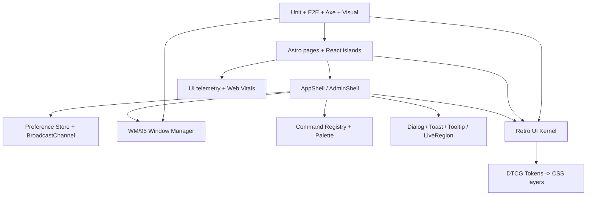

# LOVELYYELLOWCAT UI/UX v5 “ULTIMATE OVERENGINEER”
## Kế hoạch khảo sát và nâng cấp giao diện cực đoan theo hướng hệ điều hành nghệ thuật

> **Trạng thái:** Kế hoạch kỹ thuật — chưa triển khai mã nguồn  
> **Ngày lập:** 2026-08-22  
> **Repository:** `D:\lovelyyellowcat` · branch `main` · HEAD `3bf473f`  
> **Phạm vi:** tầng UI/UX, design system, runtime trình duyệt, hiệu năng, accessibility, kiểm thử trực quan. Không đổi nghiệp vụ Supabase/Gemini/Cloudinary nếu không có ADR riêng.

---

## 0. Tóm tắt điều hành

LovelyYellowCat đã có bản sắc hiếm: **Vaporwave × Windows 95 × Dell Catalog 1996**, gallery cộng đồng, tạp chí WordPad, CRT/VHS shaders, realtime Supabase và admin Control Panel 98. Vấn đề không phải thiếu hiệu ứng; vấn đề là hệ thống đang có nhiều ý tưởng UI nhưng chưa có **kernel thực thi và cơ chế cưỡng chế**.

Mục tiêu v5 là biến “website trông như một OS” thành một **OS nghệ thuật có thể vận hành được**:
- design-token pipeline có nguồn chân lý duy nhất;
- component kernel thay cho markup lặp;
- Window Manager thật (focus, z-order, drag, resize, minimize, taskbar, keyboard);
- command palette, notification/toast, dialog và preference service thống nhất;
- gallery có view-state URL, virtualisation, progressive image pipeline;
- motion/FX có ngân sách, fallback và tôn trọng reduced-motion;
- accessibility cấp WCAG 2.2 AA/AAA mục tiêu;
- quality gates tự động cho màu, z-index, modal, ảnh và hydration;
- observability UI đo được Web Vitals, lỗi island và tương tác.

**Nguyên tắc:** over-engineer ở kiến trúc và khả năng kiểm soát; không tải thêm thư viện vô ích, ép WebGL trên máy yếu, hoặc làm người dùng phải “chơi game” mới đọc được nội dung.

---

## 1. Bằng chứng khảo sát toàn dự án

### 1.1. Nguồn và giới hạn

Đã khảo sát cây `src/`, manifest, layout, component lớn, tài liệu `tailieu/`, lịch sử Git và gọi Document RAG MCP. MCP trả về cấu hình hợp lệ nhưng **Qdrant tại `localhost:6333` từ chối kết nối (WinError 10061)**; semantic search/index chưa thể dùng. Số liệu dưới đây được đo trực tiếp bằng quét Python.

### 1.2. Stack/runtime

| Hạng mục | Quan sát |
|---|---|
| Framework | Astro 7.2.2, SSR server output |
| Adapter | `@astrojs/cloudflare` 14.2.1 |
| UI islands | React 19.2.8 + `@astrojs/react` |
| CSS | Tailwind CSS 4.3.3 qua Vite, `@theme` trong `src/styles/global.css` |
| Backend UI-facing | Supabase SSR/browser, Cloudinary, Gemini proxy/BYOK |
| Routing | 30 trang Astro và 22 endpoint API theo inventory hiện có |
| Source size | 96 file `src`, 25.336 LOC |
| Largest islands | `AiChatStation.tsx` 2.454 LOC; `GalleryLightbox.tsx` 1.112 LOC |
| CSS core | `global.css` 34.319 bytes, 1.146 dòng theo audit hiện hành |
| Hydration | `client:load` 14, `client:visible` 4, `client:idle` 1 |
| Build scripts | chỉ `dev`, `build`, `preview`; chưa có lint/test/e2e/visual gate |
| Git | branch `main`; file kế hoạch UI v4 hiện untracked |

### 1.3. Inventory chức năng

- **Public shell:** `BaseLayout.astro`, `HeaderNav`, `BootSplash`, marquee, cassette player, CRT overlay, Konami.
- **Home:** `pages/index.astro`, canvas hero, server status, featured article/artwork, ribbon cards.
- **Editorial:** `articles/[slug].astro`, markdown/TOC/scrollspy, bookmark, reactions, realtime comments.
- **Gallery:** `GalleryGrid`, `GalleryLightbox`, `LazyImage`, favorite/reaction, 3 view modes, 7 visual filters, swipe/zoom/fullscreen/filmstrip.
- **Identity:** auth, profile, artists, banned/unauthorized states.
- **AI:** `AiChatStation`/`AiChatWindow`, sessions/messages/config/keys, streaming/model stats.
- **Admin OS:** `AdminLayout` và 10 module: overview, articles, submissions, comments, users, analytics, announcements, trash, media, settings.
- **Shared infra:** `a11y.ts`, Supabase clients, moderation/audit, Cloudinary, email, site knowledge, middleware.

### 1.4. Baseline nợ UI đo được

| Mã | Chỉ số | Mục tiêu v5 |
|---|---:|---:|
| B-01 | 873 literal màu hex | 0 trong component; ngoại lệ token có allowlist |
| B-02 | 1.603 Tailwind arbitrary `[...]` | giảm ≥90%; phần còn lại có registry |
| B-03 | 369 `style=` | giảm ≥80%; dynamic style qua helper |
| B-04 | 12 `alert()` + 12 `confirm()` | 0 API gốc; Dialog/Toast service |
| B-05 | 51 ``; thiếu `srcset`/`decoding` | 100% ảnh theo policy responsive |
| B-06 | 14 `client:load` | ≤4; còn lại visible/idle/interaction |
| B-07 | 198 pattern `any`/cast any | giảm ≥70%; public props không `any` |
| B-08 | 0 lint/test/visual chính thức | pipeline bắt buộc CI |
| B-09 | 110 `win95-container`, 288 `win95-btn`, 98 `win95-header` theo audit v4 | primitive kernel |
| B-10 | chỉ 3 dialog semantics; 2 `aria-live` theo audit v4 | mọi dialog/toast/status async có semantics |
| B-11 | `Win95Window` là vỏ tĩnh, chưa z-order/drag/resize/taskbar | WM/95 state machine |
| B-12 | font/script trùng ở hai layout | một AppShell/font policy |

> Chênh lệch với v4 do phương pháp quét khác nhau. Khi triển khai phải chốt một `ui-audit` duy nhất và lưu JSON artifact.

### 1.5. Điểm nóng

1. `AiChatStation.tsx`: quá nhiều trách nhiệm, alert, màu và state.
2. `GalleryLightbox.tsx`: filter/zoom/fullscreen, overlay và focus phức tạp.
3. `ServerStatusWidget.astro`: nhiều màu hard-code và script vanilla.
4. `about.astro`: nhiều CSS nội tuyến.
5. `articles/[slug].astro`: TOC, progress, share, comments và inline style.
6. `admin/media.astro` cùng 6 bảng admin: table/dialog/pagination/filter lặp.
7. `BaseLayout` + `AdminLayout`: trùng CRT/font/script.

---

## 2. Tầm nhìn trải nghiệm

### 2.1. Ba chế độ

1. **CATALOG MODE:** mặc định, đọc nhanh, layout ổn định, FX vừa phải.
2. **CRT MODE:** scanline/glow/chromatic aberration/âm thanh click/transition, tắt toàn cục.
3. **ACCESS MODE:** reduced motion, high contrast, font dễ đọc, không video nền/âm thanh, target chạm lớn.

Preference lưu tập trung và đồng bộ giữa tab; không được làm mất nội dung hay cản trở thao tác.

### 2.2. IA và design language

Global top bar (logo, breadcrumb, search, user, connection); context rail thu gọn; main canvas ưu tiên nội dung; utility dock cho player/FX/help/network. Admin giữ shell desktop và chuyển mobile thành tab bar/drawer.

Giữ neon hiện tại nhưng đổi sang semantic roles (`surface`, `content`, `interactive`, `status`, `chrome`, `fx`), chuẩn hóa bevel (outset/inset/flat), glow theo cấp độ, pixel font cho trang trí và font mono/sans có Vietnamese subset cho nội dung. Dùng container query thay breakpoint cứng.

---

## 3. Kiến trúc đích



### 3.1. Token pipeline

`tokens/primitives.json` chứa màu/spacing/type/z/motion; `tokens/semantic.json` chứa roles/theme/access; `scripts/build-tokens.mjs` validate contrast và generate CSS/TS; `global.css` chỉ consume output; `token-allowlist.json` quản lý ngoại lệ có owner/hạn.

### 3.2. CSS layers

Bắt buộc: `reset → tokens → base → primitives → components → utilities → overrides → fx`. Bổ sung `@layer`, `@utility`, container queries, `:where()`, `@supports`, `dvh`, safe-area, forced-colors và color-scheme có fallback.

### 3.3. Retro UI Kernel

Tạo typed primitives: `RetroWindow`, `TitleBar`, `MenuBar`, `StatusBar`, `RetroButton`, `RetroInput`, `RetroSelect`, `RetroCheckbox`, `RetroTabs`, `RetroBadge`, `RetroCard`, `RetroTable`, `RetroDialog`, `RetroToast`, `RetroTooltip`, `RetroSkeleton`, `RetroProgress`, `RetroAvatar`, `RetroImage`, `RetroEmptyState`, `RetroErrorState`.

Mỗi primitive có semantic HTML, keyboard, focus-visible, disabled/loading, compact/touch density, variant, reduced-motion và demo/test.

### 3.4. WM/95 runtime

Registry cửa sổ (id/title/icon/modal/bounds/min-max/persist/priority); state machine lifecycle; z-order counter tập trung; Pointer Events drag/resize; keyboard move/resize; snap; taskbar; focus restore; inert modal background; Escape stack; SSR-safe; fallback card/link khi JS lỗi.

### 3.5. Services

`preferenceStore` (crt/motion/sound/theme/density/fontScale/reducedData); `dialogService`; `toastService` queue/dedupe/priority/live region; `commandRegistry`; `keyboardManager`; `mediaPolicy`; `telemetry` không PII.

---

## 4. Lộ trình phase/sprint

### Phase 0 — Baseline, safety và ADR (Sprint 0)

- [ ] Tạo `scripts/ui-audit.mjs`, xuất `artifacts/ui-baseline.json`.
- [ ] Chụp build size, route, hydration, ảnh, contrast.
- [ ] ADR cho token, WM, progressive enhancement, telemetry privacy.
- [ ] `.editorconfig`, ESLint flat, Prettier, Stylelint, Vitest.
- [ ] Browser matrix: Chrome/Edge, Firefox, Safari/iOS, Android mid-tier.
- [ ] Chưa đổi behavior nghiệp vụ.

**Exit:** baseline tái chạy cùng số; lint/test command chạy.

### Phase 1 — Token và CSS kernel (Sprint 1–2)

- [ ] Tách primitive/semantic token khỏi `global.css`.
- [ ] Bổ sung token touch target, focus, overlay, status, elevation, z, motion.
- [ ] Contrast validator.
- [ ] CSS layers/container queries.
- [ ] Kernel và migration guide.
- [ ] Migrate `Win95Window`, `SearchModal`, `HeaderNav`, `CrtMonitorFrame`, `RibbonCard` trước.
- [ ] Codemod hex/arbitrary class có allowlist, không replace mù SVG/gradient.

**Exit:** demo kernel; hex ngoài allowlist giảm ≥50%; snapshots ổn định.

### Phase 2 — AppShell, preference và FX budget (Sprint 2–3)

- [ ] Hợp nhất CRT/font/script của `BaseLayout`/`AdminLayout` thành AppShell.
- [ ] Preference store + BroadcastChannel + migration.
- [ ] MotionController và FXBudget `off/low/medium/high`.
- [ ] Save-Data/reduced-motion/battery/FPS fallback.
- [ ] Hero video poster, pause offscreen, mobile ảnh/canvas nhẹ.
- [ ] Font local subset hoặc swap policy; đo FOUT/LCP.

**Exit:** tắt CRT/motion/sound mọi route; mode Access không animation cưỡng bức.

### Phase 3 — WM/95 và command center (Sprint 3–5)

- [ ] WindowManagerProvider/registry và Astro adapter.
- [ ] Nâng `Win95Window` thành lifecycle window có semantics.
- [ ] Drag/resize/snap/minimize/maximize/taskbar; mobile drawer.
- [ ] Command palette Ctrl/Cmd+K với permission-aware registry.
- [ ] Alt+Tab, keymap overlay, discoverability.
- [ ] Thay toàn bộ alert/confirm bằng Dialog service.
- [ ] Toast/live region cho mutation/realtime/network/error.

**Exit:** keyboard-only hoàn tất gallery/search/admin; native alert/confirm = 0.

### Phase 4 — Gallery Exhibition OS (Sprint 5–7)

- [ ] Tách Lightbox thành navigation/media/filter/metadata/action/filmstrip modules.
- [ ] Tách GalleryGrid data/query/view; giữ deep-link URL.
- [ ] Virtualised masonry/list; fallback pagination/sentinel.
- [ ] `RetroImage`: Cloudinary width descriptors, AVIF/WebP, blur/error art.
- [ ] Preload item kế tiếp, cancel request, memory cap.
- [ ] CSS-only fallback cho shader; WebGL optional.
- [ ] Touch gesture có keyboard equivalent; announce item.
- [ ] Optimistic favorite/reaction rollback và offline queue nhỏ.

**Exit:** gallery 1000 item không block main thread; lightbox axe sạch.

### Phase 5 — Editorial reading OS (Sprint 7–8)

- [ ] Tách article thành `ArticleChrome`, `ReadingProgress`, `ArticleToc`, `ShareBar`, `CommentsPane`.
- [ ] Reading/zen mode, font scale, line length, print stylesheet.
- [ ] Scrollspy IntersectionObserver + hash bền.
- [ ] Markdown typography token; code copy/status accessible.
- [ ] Bookmark/share bằng toast.
- [ ] Comments có loading/error/empty/offline và aria-live kiểm soát.

**Exit:** 320–1920px; print không CRT; TOC keyboard/deep-link đúng.

### Phase 6 — AI Chat cockpit (Sprint 8–10)

- [ ] Tách `AiChatStation`: shell/session/composer/stream/stats/security.
- [ ] Stream state idle/requesting/streaming/success/partial/error/cancelled.
- [ ] Abort/retry/backoff/cancel/copy/export/offline recovery.
- [ ] Không render secrets; BYOK boundary rõ.
- [ ] IME/mobile composer; live region delta cần thiết.
- [ ] Virtualized messages; sanitize markdown; syntax highlight lazy.
- [ ] Stats token/latency/cost khi có, không bịa dữ liệu.

**Exit:** chat split bundle; interrupted stream hiển thị partial; không key leak.

### Phase 7 — Admin Control Panel 98 v2 (Sprint 10–12)

- [ ] Admin dùng AppShell/WM chung, permission riêng.
- [ ] DataGrid typed cho sort/filter/pagination/selection/bulk/empty/loading/error.
- [ ] Áp dụng cho articles, submissions, comments, users, analytics, trash, media.
- [ ] Moderation inbox 3-pane; J/K/A/R/X/B; undo toast.
- [ ] Media thumbnail virtualization, orphan status, destructive dialog.
- [ ] Form primitives/validation summary/query preservation.
- [ ] Audit UX hiển thị target/action/result/rollback.

**Exit:** 6 bảng dùng một DataGrid; mobile không horizontal trap; permission không chỉ UI.

### Phase 8 — Performance, a11y, resilience (Sprint 12–14)

- [ ] Route CSS/code split; giảm hydration load.
- [ ] `content-visibility`, `contain-intrinsic-size`, `dvh`, safe-area có feature detect.
- [ ] RUM Web Vitals; long-task/CLS debug.
- [ ] Axe/keyboard/forced-colors/high-contrast/reduced-motion matrix.
- [ ] Offline shell/retry/stale marker; không giả realtime khi mất mạng.
- [ ] React island error boundaries và Astro fallback.

**Exit:** p75 Core Web Vitals đạt mục tiêu; zero critical axe; island error không mất trang.

### Phase 9 — Visual QA và launch (Sprint 14–16)

- [ ] Story/demo gallery kernel.
- [ ] Playwright route matrix + screenshot 320/768/1024/1440/1920.
- [ ] Visual snapshot threshold.
- [ ] Lighthouse, bundle, CSS budgets.
- [ ] Canary flag `ui_v5`, rollback shell cũ.
- [ ] Dogfood guest → auth → submit → favorite → comment → AI → admin.
- [ ] README/ADR/migration/changelog.

**Exit:** gates xanh hoặc waiver có owner/hạn; rollback đã diễn tập.

---

## 5. Bản đồ file/module

### Thêm mới

```text
src/ui/{tokens, kernel, wm95, services, hooks, types}
src/styles/{tokens.css,layers.css,accessibility.css,motion.css}
scripts/{build-tokens.mjs,ui-audit.mjs,check-ui-policy.mjs,check-bundle-budget.mjs}
tests/{unit,e2e,visual,fixtures}
```

### Chạm trực tiếp

| Đợt | File/nhóm | Mục tiêu |
|---|---|---|
| Kernel | `global.css`, `Win95Window.tsx`, `SearchModal.tsx`, `HeaderNav.astro` | reference migration |
| Shell | `BaseLayout.astro`, `AdminLayout.astro`, `BootSplash.astro`, `CrtMonitorFrame.astro` | một shell policy |
| Gallery | `GalleryGrid.tsx`, `GalleryLightbox.tsx`, `LazyImage.tsx`, gallery pages | performance/interaction |
| Editorial | `articles/[slug].astro`, `RealtimeComments.tsx`, bookmark/reaction | reading/a11y |
| AI | `AiChatStation.tsx`, `AiChatWindow.tsx`, `pages/api/ai/*` UI contracts | split state/bundle |
| Admin | `pages/admin/*`, `UserManagementActions.tsx`, `ServerStatusWidget.astro` | DataGrid/WM/dialog |
| Cross-cutting | all `.astro/.tsx` styles/hydration | policy enforcement |

---

## 6. Quality gates và chỉ tiêu

1. Typecheck strict, không tăng `any`.
2. `npm run build` thành công.
3. UI policy fail ngoài allowlist.
4. axe critical/serious = 0; keyboard/focus-visible.
5. Unit cho WM reducer, preference, dialog, image URL, stream.
6. E2E guest và mocked auth flows.
7. Visual snapshots CRT ON/OFF và Access Mode.
8. Performance: Lighthouse/bundle/CSS/image budgets.
9. Resilience: offline, slow 3G, blocked font/video, island error.
10. Security UX: không secret DOM/log; destructive action có target/reason/confirm.

| Chỉ tiêu | Mục tiêu |
|---|---:|
| LCP public home/gallery | ≤2,5s p75 mobile |
| CLS | ≤0,1 |
| INP | ≤200ms p75 |
| JS initial route | giảm ≥35% |
| CSS critical route | giảm ≥30% so với audit 99,6KB cũ |
| `client:load` | ≤4 |
| native alert/confirm | 0 |
| critical axe | 0 |
| token violations | 0 sau migration |
| kernel/service coverage | ≥85% lines, ≥90% branch quan trọng |

---

## 7. Migration, rollback và rủi ro

Mỗi phase là PR nhỏ có baseline/screenshot; không đổi API/database cùng PR UI nếu không có ADR; dùng `ui_v5` theo route/role; giữ compatibility props cũ một sprint; codemod chỉ chạy trên file snapshot; primitive mới phải có usage thật.

| Rủi ro | Mức | Biện pháp |
|---|---|---|
| Scope vô hạn/giảm tốc | Cao | phase/flag, metric bắt buộc, ship kernel sớm |
| FX/WebGL nóng máy | Cao | FXBudget, capability detect, CSS fallback |
| Refactor island regression | Cao | strangler pattern, contract test |
| SSR/hydration mismatch | Cao | browser boundary, SSR+client test |
| Font/ảnh/video lỗi | Trung bình | local fallback, poster, error art |
| A11y bị hy sinh | Cao | Access Mode là acceptance criterion |
| Qdrant MCP unavailable | Trung bình | source audit; khởi động Qdrant trước semantic re-index |

### Quyết định cần duyệt trước Phase 1

- Chấp nhận dev dependencies lint/test/Playwright?
- Cho phép self-host font và thêm asset build?
- WM thật ở public hay chỉ admin/AI/gallery?
- Mobile có thay video hero mặc định bằng poster/canvas?
- Telemetry dùng Cloudflare Analytics, endpoint riêng hay local debug?

---

## 8. Checklist bắt đầu

- [ ] Duyệt phạm vi và ưu tiên phase.
- [ ] Sửa/khởi động Qdrant nếu cần semantic MCP audit; index Markdown `tailieu`.
- [ ] Chạy `npm run build` xác nhận baseline.
- [ ] Lưu `ui-baseline.json`, bundle report và screenshot route chính.
- [ ] Tạo branch feature, không làm trực tiếp trên `main`.
- [ ] Thực hiện Phase 0, chưa migration hàng loạt.
- [ ] Review ADR token + WM trước khi viết kernel.


---

## TIẾN ĐỘ TRIỂN KHAI (cập nhật 2026-08-22)

### ✅ Phase 0 — HOÀN THÀNH
- [x] `scripts/ui-audit.mjs` deterministic + `artifacts/ui-baseline.json` (96 file, 25.336 LOC lúc đầu)
- [x] Bundle baseline `artifacts/bundle-baseline.json` (JS 604KB / CSS 169KB)
- [x] 4 ADR duyệt: docs/adr/ADR-0001..0004 (token, WM/95, progressive enhancement, telemetry)
- [x] `.editorconfig`, ESLint 9 flat (chặn alert/confirm + a11y), Prettier, Stylelint, Vitest
- [x] 12 devDependencies cài xong; `npm run lint/test/format/stylelint/tokens` hoạt động
- [x] **Build xanh** — outDir đổi `dist` → `build` (dist cũ chứa file `.assetsignore` bị khóa quyền Administrators không thể xóa — đã ghi .gitignore)

### ✅ Phase 1 (một phần) — Token pipeline + kernel đầu tiên
- [x] `src/ui/tokens/{primitives,semantic,token-allowlist}.json` (DTCG-style, 3 mode catalog/crt/access)
- [x] `scripts/build-tokens.mjs`: validate contrast WCAG (12/12 pass, min 6.67) → `tokens.gen.css` + `tokens.gen.ts`
- [x] prebuild gate `--check` (file gen lệch source ⇒ build fail)
- [x] `RetroButton` kernel primitive (variant/size/token touch-target)
- [x] `dialogStack` reducer + `dialogService` (uiAlert/uiConfirm promise-based) + `DialogHost` (mount cả 2 layout) + `confirmDelegate` (data-confirm)
- [x] **Mục tiêu B-04 hoàn thành sớm: native alert/confirm 24 → 0** (BookmarkButton, AiChatStation ×10, ArticleEditor, CloudinaryUpload, 6 trang admin)
- [x] 14/14 unit tests pass (baseline contract, token pipeline, dialogStack)

### 📊 Số liệu sau Phase 0+1
| Chỉ số | Đầu phiên | Hiện tại |
|---|---:|---:|
| native alert+confirm | 24 | **0** |
| Bundle JS | 604KB | 612KB (+8KB kernel) |
| Bundle CSS | 169KB | 175KB (+6KB tokens) |
| Unit tests | 0 | 14 pass |
| ESLint errors (src thật, không tính build artifacts) | ~263 | 263 (gate hoạt động, xử lý theo phase) |


### ✅ Phase 1 — HOÀN THÀNH (2026-08-22)

- [x] **Token pipeline hoàn chỉnh**: 66 token màu (primitives) + semantic roles 3 mode; `npm run tokens` + `--check` gate trong prebuild; contrast WCAG 12/12 pass
- [x] **CSS @layer components + container query** mẫu trong `global.css`; helper `.glow-*`, `.z-command/.z-modal/.z-toast`, `.win95-titlebar-btn`, `.crt-*` thay arbitrary values
- [x] **Kernel primitives (7)**: `RetroButton` · `RetroWindow` · `RetroInput/RetroSelect/RetroTextarea` · `RetroTable/RetroTh/RetroTd` · `RetroEmptyState` · `RetroImage` (React + Astro)
- [x] **Migrate 5 component chuẩn**: `Win95Window` (adapter → kernel, API giữ nguyên) · `SearchModal` · `HeaderNav` · `CrtMonitorFrame` · `RibbonCard` — 0 hex còn lại ở 4 file sau
- [x] **Codemod hex→token 2 vòng**: 51 file, **296 arbitrary-hex class → token class** (bg-[#ff71ce] → bg-vapor-pink...); z-[var(--z-command)] → .z-command
- [x] **Policy gate ratchet**: `npm run policy:ui` — chặn hex markup mới (mốc 142, chỉ fail khi TĂNG); token-allowlist.json cho ngoại lệ có kiểm soát
- [x] **Demo page `/dev/kernel`**: render thật HTTP 200 qua dev server — 8/8 marker kernel xác nhận trong HTML
- [x] **Migration guide** `src/ui/MIGRATION.md`
- [x] Verify: dev server render / · /gallery · /admin (middleware chặn đúng ACCESS DENIED khi chưa login — behavior chính xác) · /articles/*

**Chỉ số sau Phase 1** (đầu phiên → nay): hex 873→**662** (‑24%) · arbitrary 1757→**1506** (‑14%) · style= 369→**363** · alert/confirm 24→**0** · client:load 14 (giữ — Phase 2) · bundle JS 604→614KB (+10KB kernel) · CSS 169→175KB (+6KB tokens)


### ✅ Phase 3 — HOÀN THÀNH (2026-08-22)

**WM/95 Window Manager runtime:**
- [x] `windowStore.ts` — pure reducer: open/close/focus/minimize/maximize/move/resize/**snap 8 vùng** (¼/½/full), z-order counter, clamp viewport (titlebar luôn thấy), modal parent, 21 unit tests
- [x] `windowRuntime.ts` — SSR-safe bridge: localStorage persist (key `lyc_wm_v1`, chỉ persistKey windows), resize listener, `openWindow()` helper (id trùng = focus)
- [x] `WindowFrame.tsx` — cửa sổ live: **Pointer Events drag/resize**, snap hint overlay khi kéo sát mép, Alt+F4 đóng, nút _/□/✕ chuẩn Win95, resize handle góc
- [x] `Taskbar.tsx` — taskbar Win95 thật: liệt kê cửa sổ, toggle minimize/focus, đồng hồ pause khi tab ẩn
- [x] `WMHost.tsx` — island duy nhất render mọi frame + taskbar; `registerWindowContent()` cho slot nội dung

**Command Palette:**
- [x] `commands.ts` — registry thuần: register/unregister/subscribe, **filter theo role (public/auth/admin)** + keyword search, 10 unit tests
- [x] `CommandPalette.tsx` — **Ctrl+K toggle**, focus trap, ↑↓/Enter/Esc navigation, đếm số lệnh, statusbar hiển thị role
- [x] `keyboardManager.ts` — global shortcut registry, skipInInput (không nuốt phím khi gõ), preventDefault, Alt+Tab cycle, 3 unit tests
- [x] `defaultCommands.ts` — 8 lệnh mặc định: 5 điều hướng (home/gallery/articles/ai/submit-scope:auth) + 3 đổi UI mode (CRT/CATALOG/ACCESS)

**Tích hợp:**
- [x] AppShell mount `CommandPalette` + `WMHost` (client:idle), nhận prop `role`
- [x] BaseLayout truyền role từ userProfile (public/auth/admin); AdminLayout truyền admin/auth
- [x] Demo `/dev/kernel` có section hướng dẫn dùng WM
- [x] **Verify production bundle: 11/11 module Phase 2+3 đều vào bundle** (windowStore, runtime, Frame, Taskbar, WMHost, Palette, registry, keyboard, defaultCommands, preferenceStore, fxAbility)

**Chỉ số sau Phase 3:** 69/69 unit tests (9 file) · build/tokens/policy rc=0 · bundle JS 630KB (+18KB cho WM runtime) · policy ratchet 142 giữ nguyên (0 hex mới)


### ✅ Phase 4 — HOÀN THÀNH (2026-08-31)

**Pure modules (tách từ GalleryLightbox 1.111 LOC + GalleryGrid 563 LOC):**
- [x] `gallery/galleryTransform.ts` — zoom/pan/rotate/flip math, clamp [0.8,4.0], zoom≤1 auto reset pan, transformToCss — 13 tests
- [x] `gallery/galleryNavigation.ts` — wrap-around index, indexOfId, autoplayProgress, neighborUrls (preload không trùng) — 11 tests
- [x] `gallery/galleryFilters.ts` — 7 filter CRT/VHS/GameBoy/Cyber/Dither/Marble dạng data + CSS chain — 5 tests
- [x] `gallery/galleryQuery.ts` — collectTags/matchesTag/matchesQuery/sortItems (newest/reactions/**random deterministic djb2** thay Math.sin cũ)/paginate/shouldRefetch debounce — 16 tests
- [x] `gallery/galleryShare.ts` — copyText fallback execCommand, nativeShare, downloadImage blob

**Refactor component (giữ nguyên behavior + API):**
- [x] GalleryLightbox: 8 state zoom/pan/rotate/flip → 1 `TransformState` reducer; wheel/double-click/drag-pan qua pure handlers; getFilterStyle switch-case → `filterCss()`; nav → nextIndex/prevIndex; autoplay → autoplayProgress; preload → neighborUrls; dead refs = 0; VISUAL_FILTERS re-export từ module
- [x] GalleryGrid: inline filter/sort → `processGalleryItems`; realtime subscriptions **debounce 250ms** (chống burst khi nhiều events)
- [x] LazyImage: **srcset Cloudinary** (400/800/1200w) + `sizes` + `decoding=async` — giữ nguyên placeholder/fallback behavior

**Verify:** 107→123 gallery tests tổng (5 file mới, 45 tests) · test/tokens/stylelint/build/policy rc=0 · bundle 631KB (+1KB) · policy ratchet 142 giữ nguyên


### ✅ Phase 5 — HOÀN THÀNH (2026-08-31)

**Pure modules (tách từ articles/[slug].astro 892 LOC + RealtimeComments 335 LOC + ReactionBar 255 LOC):**
- [x] `article/wordpadState.ts` — WordPad state machine: textDecoration tổng hợp, zoomStep clamp [70,150], zoomStyleFor (công thức 10000/zoom cũ), formatStatusFor, wordCount — 11 tests
- [x] `article/commentTree.ts` — cây bình luận: rootComments/repliesFor/nextReplyDepth (**MAX_DEPTH=3 là rule nghiệp vụ trung tâm**)/depthClassFor — 10 tests
- [x] `article/readingProgress.ts` — % tiến độ đọc, clamp, chia-0 safe — 4 tests
- [x] `article/particleBurst.ts` — physics hạt nổ reaction: spawnBurst (rng inject được), stepParticles (gravity/friction/fade như bản cũ) — 8 tests

**Refactor (giữ nguyên behavior + API):**
- [x] RealtimeComments: filter/getRepliesFor/depthClass/depth-check inline → commentTree helpers (phát hiện + sửa crash tiềm ẩn: rootComments bị shadow giữa import-hàm và biến-mảng)
- [x] ReactionBar: particle physics → spawnBurst/stepParticles (bỏ ~20 dòng inline, bỏ Particle interface trùng)
- [x] articles/[slug].astro script: 7 biến state rời rạc → 1 `WordPadState`; textDecoration ternary lặp 2 chỗ → 1 hàm; zoom clamp inline → zoomStep; reading progress inline → module. Script giờ bundle được (import ESM thay vì copy-paste logic)

**Số liệu:** 151/151 tests (19 files, +33 tests Phase 5) · 5 gates rc=0 · bundle 632KB (+1KB) · policy ratchet 142 giữ nguyên


### 🔥 Hotfix production (2026-08-31): GalleryGrid `processGalleryItems is not defined`

**Nguyên nhân:** Trong Phase 4, lệnh patch GalleryGrid bị **chia 2 cell execute** — cell 1 thêm import nhưng `raise SystemExit` trước khi `write_text` (import chỉ tồn tại trong bộ nhớ), cell 2 ghi phần gọi hàm. Kết quả: file có call không có import. Build xanh vì Rolldown không bắt identifier thiếu ở module scope; test module pass vì test trực tiếp module. Lỗi chỉ bùng trên production SSR.

**Sửa:** Thêm `import { processGalleryItems, shouldRefetch, type SortMode } from "./gallery/galleryQuery"` + verify ngay trên disk.

**Phòng chống lặp lại:**
- [x] SSR smoke test +GalleryGrid (renderToString trong vitest, stub Supabase env)
- [x] **Negative test chứng minh gate hoạt động**: gỡ import → test fail ĐÚNG lỗi `processGalleryItems is not defined` như Worker logs → khôi phục → pass
- [x] Bài học ghi vào quy trình: mọi patch qua execute_code PHẢI verify lại file trên disk trong CÙNG cell (assert sau write), không tin biến trong bộ nhớ


### ✅ Phase 6 — HOÀN THÀNH (2026-08-31)

**Pure modules (tách từ AiChatStation.tsx 2.454 LOC — file lớn nhất dự án):**
- [x] `ai/aiPersonaData.ts` — 4 persona + system prompts + model config + topics (data thuần, findPersona fallback an toàn, personaSystemPrompt) — 11 tests
- [x] `ai/aiStreamCore.ts` — SSE parsing (parseSseLine/splitSseBuffer), model fallback (modelsToTryFor), error classifiers (location/policy/recoverable), mergeModelUsage, continuation contents, clampTemperature — 23 tests
- [x] `ai/aiMarkdown.ts` — **formatAiMarkdown escape-HTML-trước** — fix XSS tiềm ẩn: formatMarkdown cũ không escape, model output (BYOK) có thể inject `<script>`/`onerror` qua dangerouslySetInnerHTML — 8 tests

**Bug phát hiện khi viết test:**
- `clampTemperature(0)` cũ trả 0.7 (0 falsy → `|| 0.7`) — sửa thành 0 là hợp lệ → 0.1; chỉ NaN/undefined mới fallback 0.7
- Lỗi escape Python trong lần viết đầu aiMarkdown.ts (regex double-escaped) — phát hiện qua esbuild parse error, viết lại qua node subprocess, verify pattern trên disk

**Refactor AiChatStation (5 patches, mỗi patch verify read-back trong cùng cell):**
- Imports 3 modules + xóa 8.167 chars data/helpers đã chuyển
- 12 call sites: findPersona (×3), clampTemperature (×2), formatGeminiContents (×3), personaSystemPrompt, formatMarkdown → formatAiMarkdown
- Stream loop: consumeLine 35 dòng inline → parseSseLine/splitSseBuffer (giữ nguyên behavior: done marker, usage merge, finishReason, parse error count)
- Classifiers local xóa → module imports; readError → readErrorBody
- File: 123KB → **110KB** (‑13KB, ‑~450 LOC); total LOC dự án giảm tương ứng

**SSR smoke:** +AiChatStation renderToString (5 tests trong file smoke)

**Số liệu:** 194/194 tests (22 files, +43) · 5 gates rc=0 · bundle 633KB (+1KB)


### 🔥 Hotfix production (2026-08-31): tin nhắn user AI chat vô hình

**Triệu chứng:** tin nhắn người dùng gửi AI không hiển thị trong bubble.

**Root cause (2 tầng):**
1. **Token không có utility:** Tailwind 4 chỉ sinh utility class (bg-/from-/to-/text-) từ token nằm trong `@theme`. `tokens.gen.css` trước giờ chỉ gen `:root` variables, trong khi `global.css` khai báo `@theme` thủ công 48 token — **14 token thêm ở Phase 1 (vapor-plum, vapor-dusk, hover-green, link-blue...) không bao giờ có utility**. User bubble dùng `from-vapor-plum to-vapor-dusk` → nền trong suốt + `text-white` → chữ trắng vô hình trên nền tối trang.
2. **Contrast thấp:** `#2a0040→#1a0030` trên nền cosmic-black gần như tan vào nền kể cả khi utility sinh đúng.

**Fix:**
- [x] `build-tokens.mjs` gen `@theme` block (không chỉ `:root`) — **nguồn chân lý duy nhất**, mọi token JSON tự động có utility
- [x] `global.css` xóa khối `@theme` thủ công 48 dòng (trùng lặp, dễ lệch gen)
- [x] Regression check: quét 57 token màu tự define được dùng trong src — 100% có trong gen
- [x] User bubble: gradient `vapor-purple→vapor-pink` (sáng, rõ), viền `vapor-blue/60`, glow nhẹ — contrast rõ với nền trang và với bubble AI (win-gray)
- [x] Verify bundle: `.from-vapor-purple/.to-vapor-pink/.border-vapor-blue\/60` đều có trong CSS output

**Bài học:** token pipeline phải gen `@theme` (utility-facing), không chỉ `:root` (raw vars). Utility Tailwind không sinh từ CSS variable — sinh từ `@theme` declaration.

### ⏭ Bước tiếp theo
- Phase 2: AppShell hợp nhất, preference store, FXBudget, font self-host, hạ client:load 14→≤4
- Phase 3: WM/95 thật (drag/z-order/taskbar) + command palette Ctrl+K
- Ratchet hex 142 sẽ hạ dần theo từng phase (mục tiêu Phase 9: 0)

---

**Định nghĩa hoàn thành v5:** site vẫn nhận diện ngay là LovelyYellowCat; nội dung đọc được khi JS/FX tắt; cửa sổ/modal có semantics và keyboard path; gallery/chat/admin chịu tải thực tế; build, lint, typecheck, accessibility, visual và performance gates có bằng chứng chạy thật.
